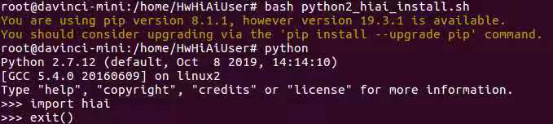
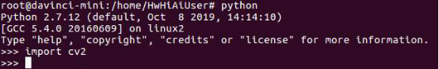

English|[中文](Readme.md)

# Installing Environment Dependencies for the Developer Board<a name="EN-US_TOPIC_0228768065"></a>

The environment dependencies of the developer board include Python, OpenCV, and HiAI libraries. Perform the following steps to install the dependencies:

1.  Run the following command to replace the source as the  **root**  user of the developer board:

    **vim /etc/apt/sources.list**

    Replace the original source with an available Arm source in China such as the USTC source and Tsinghua source.

    > **NOTE:**   
    >For details about the Arm source, visit  [https://bbs.huaweicloud.com/forum/thread-37023-1-1.html](https://bbs.huaweicloud.com/forum/thread-37023-1-1.html).  

    After the source is updated, run the following command to update the software list:

    **apt-get update**

2.  Install related dependencies. Environment dependencies are classified into Python 2 and Python 3. Currently, most Python samples use the Python 2 environment. Install Python 3 if required by referring to  [2.b](#li81699892817).
    1.  Installing the Python 2 environment dependency
        1.  Install the Python 2 dependency.

            ```
            apt-get install python-setuptools python-dev build-essential python-pip python-imaging
            ```

            ```
            pip install enum34==1.1.6 future==0.17.1 funcsigs==1.0.2 unique protobuf numpy
            ```

        2.  Install the HiAI library of Python 2.

            Download the  **python2\_hiai\_install**  script to the  **/home/HwHiAiUser**  directory of the developer board and execute the script as the  **root**  user.

            **bash python2\_hiai\_install.sh**

            If the information shown in  [Figure 1](#fig961803392713)  is displayed, the installation is successful.

            **Figure  1**  Verifying HiAI installation<a name="fig961803392713"></a>  
            

        3.  Run the following command in the  **/home/HwHiAiUser**  directory of the developer board as the  **root**  user to install the OpenCV Python library:

            **apt-get install python-opencv**

            If the information shown in  [Figure 2](#fig861883362717)  is displayed, the installation is successful.

            **Figure  2**  Verifying OpenCV installation<a name="fig861883362717"></a>  
            

            > **NOTE:**   
            >-   If the message "SSLError" is displayed during installation, run  **pip install --trusted-host pypi.org --trusted-host files.pythonhosted.org numpy==1.11.2 enum34==1.1.6 future==0.17.1 funcsigs==1.0.2 unique protobuf**  to install the dependency, indicating that the problem is resolved on a trusted host.  
            >-   Download the  **python2\_hiai\_install**  script from  [https://gitee.com/HuaweiAscend/tools/blob/master/python2\_hiai\_install.sh](https://gitee.com/HuaweiAscend/tools/blob/master/python2_hiai_install.sh).  


    2.  <a name="li81699892817"></a>Installing the Python 3 environment dependency
        1.  Install the Python 3 dependency.

            ```
            apt-get install python3-setuptools python3-dev build-essential python3-pip
            ```

            ```
            pip3 install enum34==1.1.6 future==0.17.1 funcsigs==1.0.2 unique protobuf numpy
            ```

        2.  Install the HiAI library of Python 3.

            Download the  **python3\_hiai\_install**  script to the  **/home/HwHiAiUser**  directory of the developer board and execute the script as the  **root**  user.

            **bash python3\_hiai\_install.sh**

        3.  Installing OpenCV using Python 3 requires source code. Perform the following operations:

            On the developer board, run the following commands in the  **/home/HwHiAiUser**  directory as the  **root**  user to download the source code:

            -   Run the following command to download the OpenCV source code:

                **git clone  [https://github.com/opencv/opencv.git](https://github.com/opencv/opencv.git)**

            -   Run the following command to download the OpenCV dependency:

                **git clone  [https://github.com/opencv/opencv\_contrib.git](https://github.com/opencv/opencv_contrib.git)**

            Run the following code to install the tool for building OpenCV:

            ```
            apt-get install build-essential -y
            ```
            ```
            apt-get install cmake git libgtk2.0-dev pkg-config libavcodec-dev libavformat-dev libswscale-dev libv4l-dev -y
            ```

            Run the following code to build the environment in OpenCV:

            **cd opencv**

            **mkdir release**

            **cd release/**

            ```
            cmake -D BUILD_opencv_python3=YES -D CMAKE_BUILD_TYPE=Release -D CMAKE_INSTALL_PREFIX=/usr/local -D WITH_LIBV4L=ON -D OPENCV_EXTRA_MODULES=../../opencv_contrib/modules -D PYTHON3_LIBRARIES=/usr/lib/arm-linux-gnueabihf/libpython3.5m.so -D PYTHON3_NUMPY_INCLUDE_DIRS=/usr/local/lib/python3.5/dist-packages/numpy/core/include/ ..
            ```

            Run the following code to build, install, and update the dynamic library:

            **make -j8**

            **make install**

            **ldconfig**

            > **NOTE:**   
            >-   If the message "SSLError" is displayed during installation, run  **pip3 install --trusted-host pypi.org --trusted-host files.pythonhosted.org numpy==1.11.2 enum34==1.1.6 future==0.17.1 funcsigs==1.0.2 unique protobuf**  to install the dependency, indicating that the problem is resolved on a trusted host.  
            >-   Download the  **python3\_hiai\_install**  script from  **https://gitee.com/HuaweiAscend/tools/blob/master/python3\_hiai\_install.sh**.  


