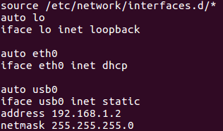
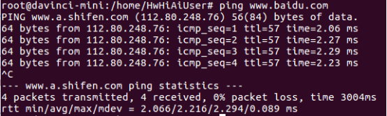

中文|[English](Readme_EN.md)

# 开发板上网

开发板可以通过服务器主机侧网络联网，也可以通过网线连接配置DHCP方式上网，此时开发板必须都以USB方式连接在服务器上。请参考以下两种方式选择其一配置开发板的网络。

1.  开发板通过服务器主机侧网络联网（无需插入网线）。
    1.  命令行执行以下命令，完成各部分配置

        配置NAT转换， -s表示只对开发者板上的IP报文做转换。

        **echo "1" \> /proc/sys/net/ipv4/ip\_forward**

        **sudo iptables -t nat -A POSTROUTING -o **_enp2s0_** -s 192.168.1.0/24 -j MASQUERADE**

        配置转发。

        **sudo iptables -A FORWARD -i** _enp0s20f0u8_ **-o **_enp2s0_** -m state --state RELATED,ESTABLISHED -j ACCEPT**

        **sudo iptables -A FORWARD -i** _enp0s20f0u8_ **-o **_enp2s0_** -j ACCEPT**

        在开发者板上配置缺省路由。

        **sudo ip route change default via **_192.168.1.251_** dev usb0**

        > **说明：**   
        >-   enp0s20f0u8： Atlas 200 DK连接的Ubuntu服务器上usb虚拟网卡，表示数据报的入口，需要根据自己的虚拟网卡名进行修改。  
        >-   enp2s0： 连接到外网的网卡（wan\)，需要根据自己的网卡名进行修改。  
        >-   192.168.1.251：这个是虚拟网卡的ip地址，需要根据自己的虚拟网卡ip进行修改。  

    2.  在开发者板上添加DNS。
        1.  打开base文件

            **sudo vi /etc/resolvconf/resolv.conf.d/base**

        2.  在文件中添加如下行

            **nameserver 114.114.114.114**

        3.  输入:wq!保存文件退出后在命令行中执行如下命令

            **resolvconf -u**

        4.  使用cat命令检查文件确认是否添加成功。

            **cat /etc/resolv.conf**

2.  开发板通过网线连接上网（需要插入网线）
    1.  开发板通过网线与可以上网的网口相连。
    2.  打开interfaces配置文件。

        **vim /etc/network/interfaces**

        配置dhcp：

        把eth0的配置修改为如下两行。

        **auto eth0**

        **iface eth0 inet dhcp**

        如[图 开发板interface文件配置](#fig171560010152)所示，输入:wq!保存退出。

        **图 1**  开发板interface文件配置  
        

    3.  执行以下命令重启开发板，使配置生效。

        **reboot**

    4.  等开发板四个灯常亮时则证明已经完成重启，重启后重新ssh登录开发板并切换到root用户下。此时可以ping外网验证网络是否通畅，如果ping通则已经配置成功；如果ping失败，则执行以下命令。成功后如[图 开发板联网配置成功](#fig1515720081517)所示。

        **ifdown eth0**

        **ifup eth0**

        **图 2**  开发板联网配置成功  
        

