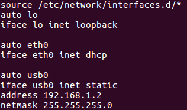
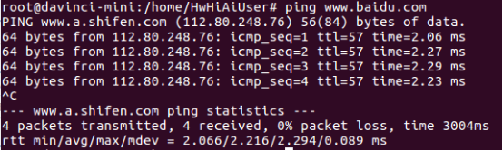

English|[中文](Readme.md)

# Connecting the Developer Board to the Network

A developer board can connect to the network through the host-side server. Alternatively, you can connect it to the network using a network cable in DHCP mode. The developer board must be connected to the server over USB. Use either of the following methods to configure the network for the developer board:

1.  Connect the developer board to the network through the host-side server \(which does not require any network cable connection\).
    1.  Run the following commands to complete the configuration:

        Configure network address translation \(NAT\).  **-s**  indicates that NAT is performed only for IP packets on the developer board.

        **echo "1" \> /proc/sys/net/ipv4/ip\_forward**

        **sudo iptables -t nat -A POSTROUTING -o **_enp2s0_** -s 192.168.1.0/24 -j MASQUERADE**

        Configure forwarding.

        **sudo iptables -A FORWARD -i** _enp0s20f0u8_ **-o **_enp2s0_** -m state --state RELATED,ESTABLISHED -j ACCEPT**

        **sudo iptables -A FORWARD -i** _enp0s20f0u8_ **-o **_enp2s0_** -j ACCEPT**

        Configure a default route on the developer board.

        **sudo ip route change default via **_192.168.1.251_** dev usb0**

        > **NOTE:**   
        >-   **enp0s20f0u8**: indicates the USB virtual NIC on the Ubuntu server connected to the Atlas 200 DK, which is the entry of data packets. You need to modify it based on the name of your virtual NIC.  
        >-   **enp2s0**: indicates the NIC \(WAN\) connected to the external network. You need to modify it based on the name of your virtual NIC.  
        >-   **192.168.1.251**: indicates the IP address of the virtual NIC. You need to modify it based on the IP address of your virtual NIC.  

    2.  Add a DNS on the developer board.
        1.  Open the base file.

            **sudo vi /etc/resolvconf/resolv.conf.d/base**

        2.  Add the following to the file:

            **nameserver 114.114.114.114**

        3.  Type  **:wq!**. Save the file and exit. Then, run the following command in the CLI:

            **resolvconf -u**

        4.  Run the following command to check whether  **nameserver 114.114.114.114**  is added to the file successfully:

            **cat /etc/resolv.conf**

2.  Connect the developer board to the network using a network cable.
    1.  Connect the developer board to a network port that can access the Internet using a network cable.
    2.  Run the following command to open the interfaces configuration file:

        **vim /etc/network/interfaces**

        Configuring DHCP:

        Configure DHCP and change the configuration of  **eth0**  to the following as shown in  [Figure 1](#fig171560010152):

        **auto eth0**

        **iface eth0 inet dhcp**

        Type  **:wq!**, save the settings, and exit.

        **Figure  1**  Configuring the interface file of the developer board  
        

    3.  Run the following command to restart the developer board for the configuration to take effect:

        **reboot**

    4.  When the four indicators on the developer board are steady on, the developer board has been restarted. After the restart, log in to the developer board over Secure Shell \(SSH\) and switch to the  **root**  user. In this case, you can ping the external network to check whether the network is normal. If the ping operation succeeds, the configuration is successful, as shown in  [Figure 2](#fig1515720081517). If the ping operation fails, run the following commands:

        **ifdown eth0**

        **ifup eth0**

        **Figure  2**  Successful network connection of the developer board  
        

