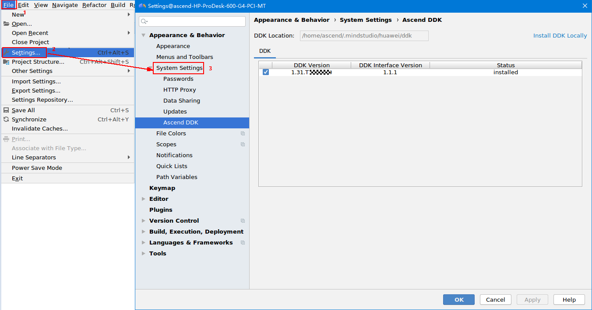

English|[中文](Readme.md)

**This case is only used for learning. It is not responsible for the effect and does not support commercial use.**

# Classification Network Application \(C++\)<a name="EN-US_TOPIC_0232633155"></a>

This application can run on the Atlas 200 DK or the AI acceleration cloud server to implement inference on a common classification network and output the first  _n_  inference results.

The applications in the current version branch adapt to  [DDK&RunTime](https://ascend.huawei.com/resources) **1.32.0.0 and later**.

## Prerequisites<a name="en-us_topic_0203223265_section137245294533"></a>

Before deploying this sample, ensure that:

-   Mind Studio  has been installed.
-   The Atlas 200 DK developer board has been connected to  Mind Studio, the cross compiler has been installed, the SD card has been prepared, and basic information has been configured.

## Software Preparation<a name="en-us_topic_0203223265_section181111827718"></a>

Before running the sample, obtain the source code package and configure the environment as follows:

1.  <a name="en-us_topic_0203223265_li953280133816"></a>Obtain the source code package.
    1.  By downloading the package

        Download the code in the  [https://gitee.com/ascend/samples/tree/1.32.0.0/sample-classification/](https://gitee.com/ascend/samples/tree/1.32.0.0/sample-classification/)  repository to any directory on the Ubuntu server where Mind Studio is located as the Mind Studio installation user. The two files must be stored in the same directory. For example, the code can be stored in  **$HOME/AscendProjects/sample-classification**.

    2.  By running the  **git**  command

        Run the following command in the  **$HOME/AscendProjects**  directory to download code:

        **git clone -b 1.32.0.0 https://gitee.com/ascend/samples.git**
        
        **mv samples/common/sample-README/sample-classification ./**

2.  <a name="en-us_topic_0203223265_li29641938112018"></a>Obtain the source network model required by the application.

    Obtain the source network model and its weight file used in the application by referring to  [Table 1](#en-us_topic_0203223265_table1119094515272)  and save them to the same directory on Ubuntu Server where  Mind Studio  is located, for example,  **$HOME/models/classification**.

    **Table  1**  Models used in the general  **classification**  network application

    <a name="en-us_topic_0203223265_table1119094515272"></a>
    <table><thead align="left"><tr id="en-us_topic_0203223265_row677354502719"><th class="cellrowborder" valign="top" width="21%" id="mcps1.2.4.1.1"><p id="en-us_topic_0203223265_p167731845122717"><a name="en-us_topic_0203223265_p167731845122717"></a><a name="en-us_topic_0203223265_p167731845122717"></a>Model Name</p>
    </th>
    <th class="cellrowborder" valign="top" width="23%" id="mcps1.2.4.1.2"><p id="en-us_topic_0203223265_p277317459276"><a name="en-us_topic_0203223265_p277317459276"></a><a name="en-us_topic_0203223265_p277317459276"></a>Description</p>
    </th>
    <th class="cellrowborder" valign="top" width="56.00000000000001%" id="mcps1.2.4.1.3"><p id="en-us_topic_0203223265_p9773114512270"><a name="en-us_topic_0203223265_p9773114512270"></a><a name="en-us_topic_0203223265_p9773114512270"></a>Download Path</p>
    </th>
    </tr>
    </thead>
    <tbody><tr id="en-us_topic_0203223265_row3122314144215"><td class="cellrowborder" valign="top" width="21%" headers="mcps1.2.4.1.1 "><p id="en-us_topic_0203223265_p14407251134314"><a name="en-us_topic_0203223265_p14407251134314"></a><a name="en-us_topic_0203223265_p14407251134314"></a>alexnet</p>
    </td>
    <td class="cellrowborder" valign="top" width="23%" headers="mcps1.2.4.1.2 "><p id="en-us_topic_0203223265_p116141194720"><a name="en-us_topic_0203223265_p116141194720"></a><a name="en-us_topic_0203223265_p116141194720"></a>Image classification inference model.</p>
    <p id="en-us_topic_0203223265_p86191184712"><a name="en-us_topic_0203223265_p86191184712"></a><a name="en-us_topic_0203223265_p86191184712"></a>It is a AlexNet model based on Caffe.</p>
    </td>
    <td class="cellrowborder" valign="top" width="56.00000000000001%" headers="mcps1.2.4.1.3 "><p id="en-us_topic_0203223265_p67311330479"><a name="en-us_topic_0203223265_p67311330479"></a><a name="en-us_topic_0203223265_p67311330479"></a>Download the source network model file and its weight file by referring to<strong id="en-us_topic_0203223265_b1034018421764"><a name="en-us_topic_0203223265_b1034018421764"></a><a name="en-us_topic_0203223265_b1034018421764"></a> README.md</strong> at <a href="https://gitee.com/HuaweiAscend/models/tree/master/computer_vision/classification/alexnet" target="_blank" rel="noopener noreferrer">https://gitee.com/HuaweiAscend/models/tree/master/computer_vision/classification/alexnet</a>.</p>
    </td>
    </tr>
    <tr id="en-us_topic_0203223265_row2399521134819"><td class="cellrowborder" valign="top" width="21%" headers="mcps1.2.4.1.1 "><p id="en-us_topic_0203223265_p3400192113488"><a name="en-us_topic_0203223265_p3400192113488"></a><a name="en-us_topic_0203223265_p3400192113488"></a>caffenet</p>
    </td>
    <td class="cellrowborder" valign="top" width="23%" headers="mcps1.2.4.1.2 "><p id="en-us_topic_0203223265_p5645133234810"><a name="en-us_topic_0203223265_p5645133234810"></a><a name="en-us_topic_0203223265_p5645133234810"></a>Image classification inference model.</p>
    <p id="en-us_topic_0203223265_p14645153244816"><a name="en-us_topic_0203223265_p14645153244816"></a><a name="en-us_topic_0203223265_p14645153244816"></a>It is a CaffeNet model based on Caffe.</p>
    </td>
    <td class="cellrowborder" valign="top" width="56.00000000000001%" headers="mcps1.2.4.1.3 "><p id="en-us_topic_0203223265_p1537844912482"><a name="en-us_topic_0203223265_p1537844912482"></a><a name="en-us_topic_0203223265_p1537844912482"></a>Download the source network model file and its weight file by referring to<strong id="en-us_topic_0203223265_b62781122719"><a name="en-us_topic_0203223265_b62781122719"></a><a name="en-us_topic_0203223265_b62781122719"></a> README.md</strong> at <a href="https://gitee.com/HuaweiAscend/models/tree/master/computer_vision/classification/caffenet" target="_blank" rel="noopener noreferrer">https://gitee.com/HuaweiAscend/models/tree/master/computer_vision/classification/caffenet</a>.</p>
    </td>
    </tr>
    <tr id="en-us_topic_0203223265_row3773114518271"><td class="cellrowborder" valign="top" width="21%" headers="mcps1.2.4.1.1 "><p id="en-us_topic_0203223265_p17738455277"><a name="en-us_topic_0203223265_p17738455277"></a><a name="en-us_topic_0203223265_p17738455277"></a>densenet</p>
    </td>
    <td class="cellrowborder" valign="top" width="23%" headers="mcps1.2.4.1.2 "><p id="en-us_topic_0203223265_p16773124511270"><a name="en-us_topic_0203223265_p16773124511270"></a><a name="en-us_topic_0203223265_p16773124511270"></a>Image classification inference model.</p>
    <p id="en-us_topic_0203223265_p2773745162718"><a name="en-us_topic_0203223265_p2773745162718"></a><a name="en-us_topic_0203223265_p2773745162718"></a>It is a DenseNet121 model based on Caffe.</p>
    </td>
    <td class="cellrowborder" valign="top" width="56.00000000000001%" headers="mcps1.2.4.1.3 "><p id="en-us_topic_0203223265_p187731945132715"><a name="en-us_topic_0203223265_p187731945132715"></a><a name="en-us_topic_0203223265_p187731945132715"></a>Download the source network model file and its weight file by referring to<strong id="en-us_topic_0203223265_b1799182010714"><a name="en-us_topic_0203223265_b1799182010714"></a><a name="en-us_topic_0203223265_b1799182010714"></a> README.md</strong> at <a href="https://gitee.com/HuaweiAscend/models/tree/master/computer_vision/classification/densenet" target="_blank" rel="noopener noreferrer">https://gitee.com/HuaweiAscend/models/tree/master/computer_vision/classification/densenet</a>.</p>
    </td>
    </tr>
    <tr id="en-us_topic_0203223265_row137731845122710"><td class="cellrowborder" valign="top" width="21%" headers="mcps1.2.4.1.1 "><p id="en-us_topic_0203223265_p477316457275"><a name="en-us_topic_0203223265_p477316457275"></a><a name="en-us_topic_0203223265_p477316457275"></a>googlenet</p>
    </td>
    <td class="cellrowborder" valign="top" width="23%" headers="mcps1.2.4.1.2 "><p id="en-us_topic_0203223265_p197731456270"><a name="en-us_topic_0203223265_p197731456270"></a><a name="en-us_topic_0203223265_p197731456270"></a>Image classification inference model.</p>
    <p id="en-us_topic_0203223265_p1877394515274"><a name="en-us_topic_0203223265_p1877394515274"></a><a name="en-us_topic_0203223265_p1877394515274"></a>It is a GoogLeNet model based on Caffe.</p>
    </td>
    <td class="cellrowborder" valign="top" width="56.00000000000001%" headers="mcps1.2.4.1.3 "><p id="en-us_topic_0203223265_p197738453275"><a name="en-us_topic_0203223265_p197738453275"></a><a name="en-us_topic_0203223265_p197738453275"></a>Download the source network model file and its weight file by referring to<strong id="en-us_topic_0203223265_b43191836877"><a name="en-us_topic_0203223265_b43191836877"></a><a name="en-us_topic_0203223265_b43191836877"></a> README.md</strong> at <a href="https://gitee.com/HuaweiAscend/models/tree/master/computer_vision/classification/googlenet" target="_blank" rel="noopener noreferrer">https://gitee.com/HuaweiAscend/models/tree/master/computer_vision/classification/googlenet</a>.</p>
    </td>
    </tr>
    <tr id="en-us_topic_0203223265_row977374512716"><td class="cellrowborder" valign="top" width="21%" headers="mcps1.2.4.1.1 "><p id="en-us_topic_0203223265_p1977324512272"><a name="en-us_topic_0203223265_p1977324512272"></a><a name="en-us_topic_0203223265_p1977324512272"></a>inception_v2</p>
    </td>
    <td class="cellrowborder" valign="top" width="23%" headers="mcps1.2.4.1.2 "><p id="en-us_topic_0203223265_p14773445122712"><a name="en-us_topic_0203223265_p14773445122712"></a><a name="en-us_topic_0203223265_p14773445122712"></a>Image classification inference model.</p>
    <p id="en-us_topic_0203223265_p877311459270"><a name="en-us_topic_0203223265_p877311459270"></a><a name="en-us_topic_0203223265_p877311459270"></a>It is an Inception V2 model based on Caffe.</p>
    </td>
    <td class="cellrowborder" valign="top" width="56.00000000000001%" headers="mcps1.2.4.1.3 "><p id="en-us_topic_0203223265_p16773145162719"><a name="en-us_topic_0203223265_p16773145162719"></a><a name="en-us_topic_0203223265_p16773145162719"></a>Download the source network model file and its weight file by referring to<strong id="en-us_topic_0203223265_b1689165415711"><a name="en-us_topic_0203223265_b1689165415711"></a><a name="en-us_topic_0203223265_b1689165415711"></a> README.md</strong> at <a href="https://gitee.com/HuaweiAscend/models/tree/master/computer_vision/classification/inception_v2" target="_blank" rel="noopener noreferrer">https://gitee.com/HuaweiAscend/models/tree/master/computer_vision/classification/inception_v2</a>.</p>
    </td>
    </tr>
    <tr id="en-us_topic_0203223265_row429165985115"><td class="cellrowborder" valign="top" width="21%" headers="mcps1.2.4.1.1 "><p id="en-us_topic_0203223265_p1050712711523"><a name="en-us_topic_0203223265_p1050712711523"></a><a name="en-us_topic_0203223265_p1050712711523"></a>inception_v3</p>
    </td>
    <td class="cellrowborder" valign="top" width="23%" headers="mcps1.2.4.1.2 "><p id="en-us_topic_0203223265_p18641141115218"><a name="en-us_topic_0203223265_p18641141115218"></a><a name="en-us_topic_0203223265_p18641141115218"></a>Image classification inference model.</p>
    <p id="en-us_topic_0203223265_p06411511105213"><a name="en-us_topic_0203223265_p06411511105213"></a><a name="en-us_topic_0203223265_p06411511105213"></a>It is an Inception V3 model based on Caffe.</p>
    </td>
    <td class="cellrowborder" valign="top" width="56.00000000000001%" headers="mcps1.2.4.1.3 "><p id="en-us_topic_0203223265_p1241971612520"><a name="en-us_topic_0203223265_p1241971612520"></a><a name="en-us_topic_0203223265_p1241971612520"></a>Download the source network model file and its weight file by referring to<strong id="en-us_topic_0203223265_b91541571817"><a name="en-us_topic_0203223265_b91541571817"></a><a name="en-us_topic_0203223265_b91541571817"></a> README.md</strong> at <a href="https://gitee.com/HuaweiAscend/models/tree/master/computer_vision/classification/inception_v3" target="_blank" rel="noopener noreferrer">https://gitee.com/HuaweiAscend/models/tree/master/computer_vision/classification/inception_v3</a>.</p>
    </td>
    </tr>
    <tr id="en-us_topic_0203223265_row6482142185210"><td class="cellrowborder" valign="top" width="21%" headers="mcps1.2.4.1.1 "><p id="en-us_topic_0203223265_p12508168115214"><a name="en-us_topic_0203223265_p12508168115214"></a><a name="en-us_topic_0203223265_p12508168115214"></a>inception_v4</p>
    </td>
    <td class="cellrowborder" valign="top" width="23%" headers="mcps1.2.4.1.2 "><p id="en-us_topic_0203223265_p8785612105217"><a name="en-us_topic_0203223265_p8785612105217"></a><a name="en-us_topic_0203223265_p8785612105217"></a>Image classification inference model.</p>
    <p id="en-us_topic_0203223265_p47851512105212"><a name="en-us_topic_0203223265_p47851512105212"></a><a name="en-us_topic_0203223265_p47851512105212"></a>It is an Inception V4 model based on Caffe.</p>
    </td>
    <td class="cellrowborder" valign="top" width="56.00000000000001%" headers="mcps1.2.4.1.3 "><p id="en-us_topic_0203223265_p1028761705212"><a name="en-us_topic_0203223265_p1028761705212"></a><a name="en-us_topic_0203223265_p1028761705212"></a>Download the source network model file and its weight file by referring to<strong id="en-us_topic_0203223265_b1192510212080"><a name="en-us_topic_0203223265_b1192510212080"></a><a name="en-us_topic_0203223265_b1192510212080"></a> README.md</strong> at <a href="https://gitee.com/HuaweiAscend/models/tree/master/computer_vision/classification/inception_v4" target="_blank" rel="noopener noreferrer">https://gitee.com/HuaweiAscend/models/tree/master/computer_vision/classification/inception_v4</a>.</p>
    </td>
    </tr>
    <tr id="en-us_topic_0203223265_row77732045152717"><td class="cellrowborder" valign="top" width="21%" headers="mcps1.2.4.1.1 "><p id="en-us_topic_0203223265_p0773114572715"><a name="en-us_topic_0203223265_p0773114572715"></a><a name="en-us_topic_0203223265_p0773114572715"></a>mobilenet_v1</p>
    </td>
    <td class="cellrowborder" valign="top" width="23%" headers="mcps1.2.4.1.2 "><p id="en-us_topic_0203223265_p11774645162715"><a name="en-us_topic_0203223265_p11774645162715"></a><a name="en-us_topic_0203223265_p11774645162715"></a>Image classification inference model.</p>
    <p id="en-us_topic_0203223265_p47741455273"><a name="en-us_topic_0203223265_p47741455273"></a><a name="en-us_topic_0203223265_p47741455273"></a>It is a MobileNet V1 model based on Caffe.</p>
    </td>
    <td class="cellrowborder" valign="top" width="56.00000000000001%" headers="mcps1.2.4.1.3 "><p id="en-us_topic_0203223265_p5586471511"><a name="en-us_topic_0203223265_p5586471511"></a><a name="en-us_topic_0203223265_p5586471511"></a>Download the source network model file and its weight file by referring to<strong id="en-us_topic_0203223265_b1788218341812"><a name="en-us_topic_0203223265_b1788218341812"></a><a name="en-us_topic_0203223265_b1788218341812"></a> README.md</strong> at <a href="https://gitee.com/HuaweiAscend/models/tree/master/computer_vision/classification/mobilenet_v1" target="_blank" rel="noopener noreferrer">https://gitee.com/HuaweiAscend/models/tree/master/computer_vision/classification/mobilenet_v1</a>.</p>
    </td>
    </tr>
    <tr id="en-us_topic_0203223265_row12774164515277"><td class="cellrowborder" valign="top" width="21%" headers="mcps1.2.4.1.1 "><p id="en-us_topic_0203223265_p187741345112718"><a name="en-us_topic_0203223265_p187741345112718"></a><a name="en-us_topic_0203223265_p187741345112718"></a>mobilenet_v2</p>
    </td>
    <td class="cellrowborder" valign="top" width="23%" headers="mcps1.2.4.1.2 "><p id="en-us_topic_0203223265_p277414519274"><a name="en-us_topic_0203223265_p277414519274"></a><a name="en-us_topic_0203223265_p277414519274"></a>Image classification inference model.</p>
    <p id="en-us_topic_0203223265_p8774174502713"><a name="en-us_topic_0203223265_p8774174502713"></a><a name="en-us_topic_0203223265_p8774174502713"></a>It is a MobileNet V2 model based on Caffe.</p>
    </td>
    <td class="cellrowborder" valign="top" width="56.00000000000001%" headers="mcps1.2.4.1.3 "><p id="en-us_topic_0203223265_p1677414514274"><a name="en-us_topic_0203223265_p1677414514274"></a><a name="en-us_topic_0203223265_p1677414514274"></a>Download the source network model file and its weight file by referring to<strong id="en-us_topic_0203223265_b45351545586"><a name="en-us_topic_0203223265_b45351545586"></a><a name="en-us_topic_0203223265_b45351545586"></a> README.md</strong> at <a href="https://gitee.com/HuaweiAscend/models/tree/master/computer_vision/classification/mobilenet_v2" target="_blank" rel="noopener noreferrer">https://gitee.com/HuaweiAscend/models/tree/master/computer_vision/classification/mobilenet_v2</a>.</p>
    </td>
    </tr>
    <tr id="en-us_topic_0203223265_row1577434516271"><td class="cellrowborder" valign="top" width="21%" headers="mcps1.2.4.1.1 "><p id="en-us_topic_0203223265_p3774194512713"><a name="en-us_topic_0203223265_p3774194512713"></a><a name="en-us_topic_0203223265_p3774194512713"></a>resnet18</p>
    </td>
    <td class="cellrowborder" valign="top" width="23%" headers="mcps1.2.4.1.2 "><p id="en-us_topic_0203223265_p7774245122713"><a name="en-us_topic_0203223265_p7774245122713"></a><a name="en-us_topic_0203223265_p7774245122713"></a>Image classification inference model.</p>
    <p id="en-us_topic_0203223265_p577494517271"><a name="en-us_topic_0203223265_p577494517271"></a><a name="en-us_topic_0203223265_p577494517271"></a>It is a ResNet 18 model based on Caffe.</p>
    </td>
    <td class="cellrowborder" valign="top" width="56.00000000000001%" headers="mcps1.2.4.1.3 "><p id="en-us_topic_0203223265_p16774144510270"><a name="en-us_topic_0203223265_p16774144510270"></a><a name="en-us_topic_0203223265_p16774144510270"></a>Download the source network model file and its weight file by referring to<strong id="en-us_topic_0203223265_b1728815118918"><a name="en-us_topic_0203223265_b1728815118918"></a><a name="en-us_topic_0203223265_b1728815118918"></a> README.md</strong> at <a href="https://gitee.com/HuaweiAscend/models/tree/master/computer_vision/classification/resnet18" target="_blank" rel="noopener noreferrer">https://gitee.com/HuaweiAscend/models/tree/master/computer_vision/classification/resnet18</a>.</p>
    </td>
    </tr>
    <tr id="en-us_topic_0203223265_row377414452276"><td class="cellrowborder" valign="top" width="21%" headers="mcps1.2.4.1.1 "><p id="en-us_topic_0203223265_p10774545142714"><a name="en-us_topic_0203223265_p10774545142714"></a><a name="en-us_topic_0203223265_p10774545142714"></a>resnet50</p>
    </td>
    <td class="cellrowborder" valign="top" width="23%" headers="mcps1.2.4.1.2 "><p id="en-us_topic_0203223265_p97741245142712"><a name="en-us_topic_0203223265_p97741245142712"></a><a name="en-us_topic_0203223265_p97741245142712"></a>Image classification inference model.</p>
    <p id="en-us_topic_0203223265_p177412456271"><a name="en-us_topic_0203223265_p177412456271"></a><a name="en-us_topic_0203223265_p177412456271"></a>It is a ResNet 50 model based on Caffe.</p>
    </td>
    <td class="cellrowborder" valign="top" width="56.00000000000001%" headers="mcps1.2.4.1.3 "><p id="en-us_topic_0203223265_p57747459272"><a name="en-us_topic_0203223265_p57747459272"></a><a name="en-us_topic_0203223265_p57747459272"></a>Download the source network model file and its weight file by referring to<strong id="en-us_topic_0203223265_b135771417991"><a name="en-us_topic_0203223265_b135771417991"></a><a name="en-us_topic_0203223265_b135771417991"></a> README.md</strong> at <a href="https://gitee.com/HuaweiAscend/models/tree/master/computer_vision/classification/resnet50" target="_blank" rel="noopener noreferrer">https://gitee.com/HuaweiAscend/models/tree/master/computer_vision/classification/resnet50</a>.</p>
    </td>
    </tr>
    <tr id="en-us_topic_0203223265_row377484514279"><td class="cellrowborder" valign="top" width="21%" headers="mcps1.2.4.1.1 "><p id="en-us_topic_0203223265_p1777454516275"><a name="en-us_topic_0203223265_p1777454516275"></a><a name="en-us_topic_0203223265_p1777454516275"></a>resnet101</p>
    </td>
    <td class="cellrowborder" valign="top" width="23%" headers="mcps1.2.4.1.2 "><p id="en-us_topic_0203223265_p15774124516274"><a name="en-us_topic_0203223265_p15774124516274"></a><a name="en-us_topic_0203223265_p15774124516274"></a>Image classification inference model.</p>
    <p id="en-us_topic_0203223265_p7774134552720"><a name="en-us_topic_0203223265_p7774134552720"></a><a name="en-us_topic_0203223265_p7774134552720"></a>It is a ResNet 101 model based on Caffe.</p>
    </td>
    <td class="cellrowborder" valign="top" width="56.00000000000001%" headers="mcps1.2.4.1.3 "><p id="en-us_topic_0203223265_p117741545132710"><a name="en-us_topic_0203223265_p117741545132710"></a><a name="en-us_topic_0203223265_p117741545132710"></a>Download the source network model file and its weight file by referring to<strong id="en-us_topic_0203223265_b1586253018915"><a name="en-us_topic_0203223265_b1586253018915"></a><a name="en-us_topic_0203223265_b1586253018915"></a> README.md</strong> at <a href="https://gitee.com/HuaweiAscend/models/tree/master/computer_vision/classification/resnet101" target="_blank" rel="noopener noreferrer">https://gitee.com/HuaweiAscend/models/tree/master/computer_vision/classification/resnet101</a>.</p>
    </td>
    </tr>
    <tr id="en-us_topic_0203223265_row14774154513279"><td class="cellrowborder" valign="top" width="21%" headers="mcps1.2.4.1.1 "><p id="en-us_topic_0203223265_p1077413452272"><a name="en-us_topic_0203223265_p1077413452272"></a><a name="en-us_topic_0203223265_p1077413452272"></a>resnet152</p>
    </td>
    <td class="cellrowborder" valign="top" width="23%" headers="mcps1.2.4.1.2 "><p id="en-us_topic_0203223265_p177434517275"><a name="en-us_topic_0203223265_p177434517275"></a><a name="en-us_topic_0203223265_p177434517275"></a>Image classification inference model.</p>
    <p id="en-us_topic_0203223265_p877515459276"><a name="en-us_topic_0203223265_p877515459276"></a><a name="en-us_topic_0203223265_p877515459276"></a>It is a ResNet 152 model based on Caffe.</p>
    </td>
    <td class="cellrowborder" valign="top" width="56.00000000000001%" headers="mcps1.2.4.1.3 "><p id="en-us_topic_0203223265_p777514582712"><a name="en-us_topic_0203223265_p777514582712"></a><a name="en-us_topic_0203223265_p777514582712"></a>Download the source network model file and its weight file by referring to<strong id="en-us_topic_0203223265_b749519434920"><a name="en-us_topic_0203223265_b749519434920"></a><a name="en-us_topic_0203223265_b749519434920"></a> README.md</strong> at <a href="https://gitee.com/HuaweiAscend/models/tree/master/computer_vision/classification/resnet152" target="_blank" rel="noopener noreferrer">https://gitee.com/HuaweiAscend/models/tree/master/computer_vision/classification/resnet152</a>.</p>
    </td>
    </tr>
    <tr id="en-us_topic_0203223265_row37752450270"><td class="cellrowborder" valign="top" width="21%" headers="mcps1.2.4.1.1 "><p id="en-us_topic_0203223265_p977544513278"><a name="en-us_topic_0203223265_p977544513278"></a><a name="en-us_topic_0203223265_p977544513278"></a>vgg16</p>
    </td>
    <td class="cellrowborder" valign="top" width="23%" headers="mcps1.2.4.1.2 "><p id="en-us_topic_0203223265_p1177514522713"><a name="en-us_topic_0203223265_p1177514522713"></a><a name="en-us_topic_0203223265_p1177514522713"></a>Image classification inference model.</p>
    <p id="en-us_topic_0203223265_p10775194582713"><a name="en-us_topic_0203223265_p10775194582713"></a><a name="en-us_topic_0203223265_p10775194582713"></a>It is a VGG16 model based on Caffe.</p>
    </td>
    <td class="cellrowborder" valign="top" width="56.00000000000001%" headers="mcps1.2.4.1.3 "><p id="en-us_topic_0203223265_p18775124582720"><a name="en-us_topic_0203223265_p18775124582720"></a><a name="en-us_topic_0203223265_p18775124582720"></a>Download the source network model file and its weight file by referring to<strong id="en-us_topic_0203223265_b19172155512916"><a name="en-us_topic_0203223265_b19172155512916"></a><a name="en-us_topic_0203223265_b19172155512916"></a> README.md</strong> at <a href="https://gitee.com/HuaweiAscend/models/tree/master/computer_vision/classification/vgg16" target="_blank" rel="noopener noreferrer">https://gitee.com/HuaweiAscend/models/tree/master/computer_vision/classification/vgg16</a>.</p>
    </td>
    </tr>
    <tr id="en-us_topic_0203223265_row2775194518272"><td class="cellrowborder" valign="top" width="21%" headers="mcps1.2.4.1.1 "><p id="en-us_topic_0203223265_p5775154516272"><a name="en-us_topic_0203223265_p5775154516272"></a><a name="en-us_topic_0203223265_p5775154516272"></a>vgg19</p>
    </td>
    <td class="cellrowborder" valign="top" width="23%" headers="mcps1.2.4.1.2 "><p id="en-us_topic_0203223265_p0775204532711"><a name="en-us_topic_0203223265_p0775204532711"></a><a name="en-us_topic_0203223265_p0775204532711"></a>Image classification inference model.</p>
    <p id="en-us_topic_0203223265_p1477554519275"><a name="en-us_topic_0203223265_p1477554519275"></a><a name="en-us_topic_0203223265_p1477554519275"></a>It is a VGG19 model based on Caffe.</p>
    </td>
    <td class="cellrowborder" valign="top" width="56.00000000000001%" headers="mcps1.2.4.1.3 "><p id="en-us_topic_0203223265_p777554542713"><a name="en-us_topic_0203223265_p777554542713"></a><a name="en-us_topic_0203223265_p777554542713"></a>Download the source network model file and its weight file by referring to<strong id="en-us_topic_0203223265_b1268419531013"><a name="en-us_topic_0203223265_b1268419531013"></a><a name="en-us_topic_0203223265_b1268419531013"></a> README.md</strong> at <a href="https://gitee.com/HuaweiAscend/models/tree/master/computer_vision/classification/vgg19" target="_blank" rel="noopener noreferrer">https://gitee.com/HuaweiAscend/models/tree/master/computer_vision/classification/vgg19</a>.</p>
    </td>
    </tr>
    <tr id="en-us_topic_0203223265_row17513194404914"><td class="cellrowborder" valign="top" width="21%" headers="mcps1.2.4.1.1 "><p id="en-us_topic_0203223265_p7513164419495"><a name="en-us_topic_0203223265_p7513164419495"></a><a name="en-us_topic_0203223265_p7513164419495"></a>squeezenet</p>
    </td>
    <td class="cellrowborder" valign="top" width="23%" headers="mcps1.2.4.1.2 "><p id="en-us_topic_0203223265_p1315111145015"><a name="en-us_topic_0203223265_p1315111145015"></a><a name="en-us_topic_0203223265_p1315111145015"></a>Image classification inference model.</p>
    <p id="en-us_topic_0203223265_p1515131114501"><a name="en-us_topic_0203223265_p1515131114501"></a><a name="en-us_topic_0203223265_p1515131114501"></a>It is a SqueezeNet model based on Caffe.</p>
    </td>
    <td class="cellrowborder" valign="top" width="56.00000000000001%" headers="mcps1.2.4.1.3 "><p id="en-us_topic_0203223265_p16265437125015"><a name="en-us_topic_0203223265_p16265437125015"></a><a name="en-us_topic_0203223265_p16265437125015"></a>Download the source network model file and its weight file by referring to<strong id="en-us_topic_0203223265_b12997191414105"><a name="en-us_topic_0203223265_b12997191414105"></a><a name="en-us_topic_0203223265_b12997191414105"></a> README.md</strong> at <a href="https://gitee.com/HuaweiAscend/models/tree/master/computer_vision/classification/squeezenet" target="_blank" rel="noopener noreferrer">https://gitee.com/HuaweiAscend/models/tree/master/computer_vision/classification/squeezenet</a>.</p>
    </td>
    </tr>
    <tr id="en-us_topic_0203223265_row17757454270"><td class="cellrowborder" valign="top" width="21%" headers="mcps1.2.4.1.1 "><p id="en-us_topic_0203223265_p17759452279"><a name="en-us_topic_0203223265_p17759452279"></a><a name="en-us_topic_0203223265_p17759452279"></a>dpn98</p>
    </td>
    <td class="cellrowborder" valign="top" width="23%" headers="mcps1.2.4.1.2 "><p id="en-us_topic_0203223265_p4775545162716"><a name="en-us_topic_0203223265_p4775545162716"></a><a name="en-us_topic_0203223265_p4775545162716"></a>Image classification inference model.</p>
    <p id="en-us_topic_0203223265_p1577504516278"><a name="en-us_topic_0203223265_p1577504516278"></a><a name="en-us_topic_0203223265_p1577504516278"></a>It is a DPN-98 model based on Caffe.</p>
    </td>
    <td class="cellrowborder" valign="top" width="56.00000000000001%" headers="mcps1.2.4.1.3 "><p id="en-us_topic_0203223265_p19776154592711"><a name="en-us_topic_0203223265_p19776154592711"></a><a name="en-us_topic_0203223265_p19776154592711"></a>Download the source network model file and its weight file by referring to<strong id="en-us_topic_0203223265_b1087911266106"><a name="en-us_topic_0203223265_b1087911266106"></a><a name="en-us_topic_0203223265_b1087911266106"></a> README.md</strong> at <a href="https://gitee.com/HuaweiAscend/models/tree/master/computer_vision/classification/dpn98" target="_blank" rel="noopener noreferrer">https://gitee.com/HuaweiAscend/models/tree/master/computer_vision/classification/dpn98</a>.</p>
    </td>
    </tr>
    </tbody>
    </table>

3.  Log in to Ubuntu Server where Mind Studio is located as the Mind Studio installation user, confirm the current DDK version, and set the environment variables  **DDK\_HOME**,  **tools\_version**, and  **LD\_LIBRARY\_PATH**.
    1.  <a name="en-us_topic_0203223265_en-us_topic_0203223294_li61417158198"></a>Query the current DDK version.

        A DDK version can be queried by using either Mind Studio or the DDK software package.

        -   Using Mind Studio

            On the project page of Mind Studio, choose  **File \> Settings \> System Settings \> Ascend DDK**  to query the DDK version.

            **Figure  1**  Querying the DDK version<a name="en-us_topic_0203223265_en-us_topic_0203223294_fig17553193319118"></a>  
            

            The displayed  **DDK Version**  is the current DDK version, for example,  **1.32.0.B080**.

        -   Using the DDK software package

            Obtain the DDK version based on the DDK package name.

            DDK package name format:  **Ascend\_DDK-\{software version\}-\{interface version\}-x86\_64.ubuntu16.04.tar.gz**

            _Software version_  indicates the DDK software version.

            For example:

            If the DDK package name is  **Ascend\_DDK-1.32.0.B080-1.1.1-x86\_64.ubuntu16.04.tar.gz**, the DDK version is  **1.32.0.B080**.

    2.  Set environment variables.

        **vim \~/.bashrc**

        Run the following commands to add the environment variables  **DDK\_HOME**  and  **LD\_LIBRARY\_PATH**  to the last line:

        **export tools\_version=_1.32.X.X_**

        **export DDK\_HOME=$HOME/.mindstudio/huawei/ddk/_1.32.X.X_/ddk**

        **export LD\_LIBRARY\_PATH=$DDK\_HOME/lib/x86\_64-linux-gcc5.4**

        > **NOTE:**   
        >-   **_1.32.X.X_**  indicates the DDK version queried in  [a](#en-us_topic_0203223265_en-us_topic_0203223294_li61417158198). Set this parameter based on the query result, for example,  **1.32.0.B080**.  
        >-   If the environment variables have been added, skip this step.  

        Type  **:wq!**  to save settings and exit.

        Run the following command for the environment variable to take effect:

        **source \~/.bashrc**

4.  Convert the source network model to a model supported by the Ascend AI processor.

    1.  Choose  **Tools \> Model Convert**  from the main menu of  Mind Studio.
    2.  On the  **Model Conversion**  page that is displayed, configure model conversion.
        -   Select the model file downloaded in  [Step 2](#en-us_topic_0203223265_li29641938112018)  for  **Model File**. The weight file is automatically matched and filled in  **Weight File**.
        -   Set  **Model Name**  to the model name in  [Table 1](#en-us_topic_0203223265_table1119094515272).

            

        -   For the GoogleNet and Inception\_v2 models, a general classification network application processes one image at a time. Therefore, the value of  **N**  in  **Input Node: data**  must be set to  **1**  during conversion, as shown in  [Figure 2](#en-us_topic_0203223265_fig95695336322). In the  **AIPP**  configuration, set  **Input Image Size**  to  **256**  and  **224**, respectively. In this sample, the value must be 128 x 16 aligned. Set  **Model Image Format**  to  **BGR888\_U8**, as shown in  [Figure 3](#en-us_topic_0203223265_fig14632122193310).

            **Figure  2**  Nodes configuration example<a name="en-us_topic_0203223265_fig95695336322"></a>  
            

            **Figure  3**  AIPP configuration example<a name="en-us_topic_0203223265_fig14632122193310"></a>  
            

    3.  Click  **OK**  to start model conversion.

        After successful conversion, an .om offline model is generated in the  **$HOME/modelzoo/XXX/device**  directory.

    > **NOTE:**   
    >-   For details about the descriptions of each step and parameters in model conversion on Mind Studio, see "Model Conversion" in the  [Mind Studio User Guide](https://ascend.huawei.com/doc/mindstudio/).  
    >-   **XXX**  indicates the name of the model to be converted. For example,  **googlenet.om**  is stored in  **$HOME/modelzoo/googlenet/device**.  

5.  <a name="en-us_topic_0203223265_li470213205618"></a>Upload the converted .om model file to the  **sample-classification/script**  directory under the source code path in  [Step 1](#en-us_topic_0203223265_li953280133816).

## Build<a name="en-us_topic_0203223265_section18931344873"></a>

1.  Open the project.

    Go to the directory that stores the decompressed installation package as the Mind Studio installation user in CLI mode, for example,  **$HOME/MindStudio-ubuntu/bin**. Run the following command to start Mind Studio:

    **./MindStudio.sh**

    Open the  **sample-classification**  project, as shown in  [Figure 4](#en-us_topic_0203223265_fig11106241192810).

    **Figure  4**  Opening the classification project<a name="en-us_topic_0203223265_fig11106241192810"></a>  
    

2.  Configure project information in the  **src/param\_configure.conf**  file.

    **Figure  5**  Configuration file path<a name="en-us_topic_0203223265_fig0391184062214"></a>  
    

    The default configurations of the configuration file are as follows:

    ```
    remote_host=192.168.1.2
    model_name=alexnet.om
    ```

    -   **remote\_host**: IP address of the Atlas 200 DK developer board
    -   **model\_name**: offline model name

    > **NOTE:**   
    >-   All the three parameters must be set. Otherwise, the build fails.  
    >-   Do not use double quotation marks \(""\) during parameter settings.  
    >-   Only one model name can be typed into the configuration file. The typed model must be one of the models stored in  [Step 5](#en-us_topic_0203223265_li470213205618). AlexNet is used as an example. You can use any of other models listed in this sample and execute it by performing the preceding steps.  
    >-   Modify the default configurations as required.  

3.  Run the  **deploy.sh**  script to adjust configuration parameters and download and compile the third-party library. Open the  **Terminal**  window of Mind Studio. By default, the home directory of the code is used. Run the  **deploy.sh**  script in the background to deploy the environment, as shown in  [Figure 6](#en-us_topic_0203223265_fig478266192619).

    **Figure  6**  Running the deploy.sh script<a name="en-us_topic_0203223265_fig478266192619"></a>  
    

    > **NOTE:**   
    >-   During the first deployment, if no third-party library is used, the system automatically downloads and builds the third-party library, which may take a long time. The third-party library can be directly used for the subsequent build.  
    >-   During deployment, select the IP address of the host that communicates with the developer board. Generally, the IP address is the IP address configured for the virtual NIC. If the IP address is in the same network segment as the IP address of the developer board, it is automatically selected for deployment. If they are not in the same network segment, you need to manually type the IP address of the host that communicates with the Atlas DK to complete the deployment.  

4.  Start building. Open Mind Studio and choose  **Build \> Build \> Build-Configuration**  from the main menu. The  **build**  and  **run**  folders are generated in the directory, as shown in  [Figure 7](#en-us_topic_0203223265_fig1741464713019).

    **Figure  7**  Build and file generating<a name="en-us_topic_0203223265_fig1741464713019"></a>  
    

    > **NOTICE:**   
    >When you build a project for the first time,  **Build \> Build**  is unavailable. You need to choose  **Build \> Edit Build Configuration**  to set parameters before the build.  

5.  Upload the images to be inferred to any directory of the  **HwHiAiUser**  user on the host side.

    The image requirements are as follows:

    -   Format: jpg, png, and bmp
    -   Width of the input image: an integer ranging from 16px to 4096px
    -   Height of the input image: an integer ranging from 16px to 4096px


## Run<a name="en-us_topic_0203223265_section372782554919"></a>

1.  On the toolbar of Mind Studio, click  **Run**  and choose  **Run \> Run 'sample-classification'**. As shown in  [Figure 8](#en-us_topic_0203223265_fig93931954162719), the executable application is running on the developer board.

    **Figure  8**  Running application<a name="en-us_topic_0203223265_fig93931954162719"></a>  
    

    You can ignore the error information reported during the execution because Mind Studio cannot transfer parameters for an executable application. In the preceding steps, the executable application and dependent library files are deployed to the developer board. You need to log in to the developer board in SSH mode and manually execute the files in the corresponding directory. For details, see the following steps.

2.  Log in to the host side as the  **HwHiAiUser**  user in SSH mode on Ubuntu Server where  Mind Studio  is located.

    **ssh HwHiAiUser@**_host\_ip_

    For the Atlas 200 DK, the default value of  _**host\_ip**_  is  **192.168.1.2**  \(USB connection mode\) or  **192.168.0.2**  \(NIC connection mode\).

3.  Go to the path of the executable files of the classification network application.

    **cd \~/HIAI\_PROJECTS/workspace\_mind\_studio/sample-classification\__XXXXX_/out**

    > **NOTE:**   
    >-   In this path,  _**XXXXX **_in** sample-classification\__XXXXX_**  is a combination of letters and digits generated randomly each time the application is built.  

4.  Run the application.

    Run the  **run\_classification.py**  script to print the inference result on the execution terminal.

    Command example:

    **python3 run\_classification.py -w  _224_  -h  _224_  -i** **_./example.jpg_** **-n  _10_**

    -   **-w/model\_width**: width of the input image of a model. The value is an integer ranging from 16 to 4096.Here is the width of the input data required for the sample model alexnet.om: 227. If you use other models, please refer to https://bbs.huaweicloud.com/forum/thread-54058-1-1.html Input data width
    -   **-h/model\_height**: height of the input image of a model. The value is an integer ranging from 16 to 4096.Here is the sample model alexnet.om requires high input data: 227, if you use other models, please refer to https://bbs.huaweicloud.com/forum/thread-54058-1-1.html Input data high
    -   **-i/input\_path**: path of the input image. It can be a directory, indicating that all images in the current directory are used as input. \(Multiple inputs can be specified\).
    -   **-n/top\_n**: the first  _n_  inference results that are output

    For other parameters, run the  **python3 run\_classification.py --help**  command to check help information.


