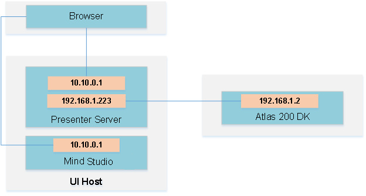

English|[中文](Readme.md)

**This case is only used for learning. It is not responsible for the effect and does not support commercial use.**

# Face Detection \(Python\)<a name="EN-US_TOPIC_0234086860"></a>

You can deploy this application on the Atlas 200 DK to collect camera data in real time and predict facial information in the video.

The current application adapts to  [DDK&RunTime](https://ascend.huawei.com/resources)  of 1.3.0.0 as well as 1.32.0.0 and later versions.

## Prerequisites<a name="en-us_topic_0228757088_section1524472882216"></a>

Before deploying this sample, ensure that:

-   Mind Studio  has been installed.

-   The Atlas 200 DK developer board has been connected to  Mind Studio, the SD card has been created, and the build environment has been configured.
-   The developer board is connected to the Internet over the USB port by default. The IP address of the developer board is  **192.168.1.2**.

## Software Preparation<a name="en-us_topic_0228757088_section772075917223"></a>

Before running this application, obtain the source code package and configure the environment as follows.

1.  <a name="en-us_topic_0228757088_li953280133816"></a>Obtain the source code package.
    1.  By downloading the package

        Download all code in the repository at  [https://gitee.com/Atlas200DK/sample-facedetection-python](https://gitee.com/Atlas200DK/sample-facedetection-python)  to any directory on Ubuntu Server where  Mind Studio  is located as the  Mind Studio  installation user, for example,  **$HOME/sample-facedetection-python**.

    2.  By running the  **git**  command

        Run the following command in the  **$HOME/AscendProjects**  directory to download code:

        **git clone https://gitee.com/Atlas200DK/sample-facedetection-python.git**

2.  <a name="en-us_topic_0228757088_li12291771229"></a>Obtain the network model required by the application.

    Refer to  [Table 1](#en-us_topic_0228757088_table1119094515272)  to obtain the source network model used in this application and the corresponding weight file. Save them to any directory of the Ubuntu server with  Mind Studio  installed, for example,  **$HOME/ascend/models/facedetection-python**.

    **Table  1**  Face detection \(Python\) model

    <a name="en-us_topic_0228757088_table1119094515272"></a>
    <table><thead align="left"><tr id="en-us_topic_0228757088_row677354502719"><th class="cellrowborder" valign="top" width="12.85%" id="mcps1.2.4.1.1"><p id="en-us_topic_0228757088_p167731845122717"><a name="en-us_topic_0228757088_p167731845122717"></a><a name="en-us_topic_0228757088_p167731845122717"></a>Model Name</p>
    </th>
    <th class="cellrowborder" valign="top" width="12.04%" id="mcps1.2.4.1.2"><p id="en-us_topic_0228757088_p277317459276"><a name="en-us_topic_0228757088_p277317459276"></a><a name="en-us_topic_0228757088_p277317459276"></a>Description</p>
    </th>
    <th class="cellrowborder" valign="top" width="75.11%" id="mcps1.2.4.1.3"><p id="en-us_topic_0228757088_p9773114512270"><a name="en-us_topic_0228757088_p9773114512270"></a><a name="en-us_topic_0228757088_p9773114512270"></a>Download Path</p>
    </th>
    </tr>
    </thead>
    <tbody><tr id="en-us_topic_0228757088_row3122314144215"><td class="cellrowborder" valign="top" width="12.85%" headers="mcps1.2.4.1.1 "><p id="en-us_topic_0228757088_p13106121801715"><a name="en-us_topic_0228757088_p13106121801715"></a><a name="en-us_topic_0228757088_p13106121801715"></a>face_detection</p>
    </td>
    <td class="cellrowborder" valign="top" width="12.04%" headers="mcps1.2.4.1.2 "><p id="en-us_topic_0228757088_p13106171831710"><a name="en-us_topic_0228757088_p13106171831710"></a><a name="en-us_topic_0228757088_p13106171831710"></a>Network model for face detection,</p>
    <p id="en-us_topic_0228757088_p18106718131714"><a name="en-us_topic_0228757088_p18106718131714"></a><a name="en-us_topic_0228757088_p18106718131714"></a>converted from the Caffe-based ResNet10-SSD300 model</p>
    </td>
    <td class="cellrowborder" valign="top" width="75.11%" headers="mcps1.2.4.1.3 "><p id="en-us_topic_0228757088_p110671813170"><a name="en-us_topic_0228757088_p110671813170"></a><a name="en-us_topic_0228757088_p110671813170"></a>Download the source network model file and its weight file by referring to<strong id="en-us_topic_0228757088_b1539945174515"><a name="en-us_topic_0228757088_b1539945174515"></a><a name="en-us_topic_0228757088_b1539945174515"></a> README.md</strong> at <a href="https://gitee.com/HuaweiAscend/models/tree/master/computer_vision/object_detect/face_detection" target="_blank" rel="noopener noreferrer">https://gitee.com/HuaweiAscend/models/tree/master/computer_vision/object_detect/face_detection</a>.</p>
    </td>
    </tr>
    </tbody>
    </table>

3.  Convert the source network model to a model supported by the Ascend AI processor.
    1.  Choose  **Tool \> Convert Model**  from the main menu of  Mind Studio. The  **Convert Model**  page is displayed.
    2.  On the  **Convert Model**  page, set  **Model File **and  **Weight File**  to the model file and weight file downloaded in  [Step 2](#en-us_topic_0228757088_li12291771229), respectively.
        -   Set  **Model Name**  to the model name in  [Table 1](#en-us_topic_0228757088_table1119094515272).
        -   On the  **AIPP **configuration page, select  **BGR888\_U8 **for** Model Image Format**.
        -   Retain the default values for other parameters.

    3.  Click  **OK**  to start model conversion.

        After a model of 1.1.0.0 or 1.3.0.0 version is successfully converted, a .om offline model is generated in the  **$HOME/tools/che/model-zoo/my-model/xxx**  directory.

        After a model of 1.31.0.0 or a later version is successfully converted, an .om offline model is generated in the  **$HOME/modelzoo/xxx/device/_xxx_.om**  directory.

    4.  Upload the converted .om model file to the  **sample-facedetection-python/model**  directory under the source code path in  [Step 1](#en-us_topic_0228757088_li953280133816).

4.  Log in to Ubuntu Server where  Mind Studio  is located as the  Mind Studio  installation user and set the environment variable  **DDK\_HOME**.

    **vim \~/.bashrc**

    1.  For the 1.3.0.0 version, run the following commands to append the end line with the environment variables  **DDK\_HOME**  and  **LD\_LIBRARY\_PATH**:

        **export DDK\_HOME=$HOME/tools/che/ddk/ddk**

        **export LD\_LIBRARY\_PATH=$DDK\_HOME/uihost/lib**

    2.  For 1.32.0.0 or later, run the following commands to append the environment variables:

        **export tools\_version=_1.32.X.X_**

        **export DDK\_HOME= $HOME/.mindstudio/huawei/ddk/$tools\_version/ddk**

        **export LD\_LIBRARY\_PATH= $DDK\_HOME/lib/x86\_64-linux-gcc5.4:$DDK\_HOME/uihost/lib**

    > **NOTE:**   
    >-   For 1.32.0.0 or later,  **1.32.X.X**  indicates the DDK version, which can be obtained from the DDK package name. For example, if the DDK package name is  **Ascend\_DDK-1.32.0.B080-1.1.1-x86\_64.ubuntu16.04.tar.gz**, the DDK version is  **1.32.0.B080**.  
    >-   If the environment variables have been added, skip this step.  

    Type  **:wq!**  to save settings and exit.

    Run the following command for the environment variable to take effect:

    **source \~/.bashrc**


## Environment Settings<a name="en-us_topic_0228757088_section1637464117139"></a>

Note: If the HiAI library, OpenCV library, and related dependencies have been installed on the developer board, skip this step.

1.  Configure the network connection of the developer board.

    Configure the network connection of the Atlas DK developer board by referring to  [https://gitee.com/Atlas200DK/sample-README/tree/master/DK\_NetworkConnect](https://gitee.com/Atlas200DK/sample-README/tree/master/DK_NetworkConnect).

2.  Install the environment dependencies.

    Configure the environment dependency by referring to  [https://gitee.com/Atlas200DK/sample-README/tree/master/DK\_Environment](https://gitee.com/Atlas200DK/sample-README/tree/master/DK_Environment).


## Deployment<a name="en-us_topic_0228757088_section7994174585917"></a>

1.  Go to the root directory where the crowdcounting-python application code is located as the  Mind Studio  installation user, for example,  **$HOME/sample-facedetection-python**.
2.  In  **face\_detection.conf**, change  **presenter\_server\_ip **to the IP address of the ETH port on the Ubuntu server for connecting to the Atlas 200 DK developer board, and  **atlas200dk\_board\_ip **to the IP address of the ETH port on the developer board for connecting to the Ubuntu server.

    In USB connection mode, the IP address of the USB ETH port on the Atlas DK is 192.168.1.2, and the IP address of the virtual NIC ETH port on the Ubuntu server connected to the Atlas DK is 192.168.1.134. The configuration file content is as follows:

    **presenter\_server\_ip=192.168.1.134**

    **presneter\_server\_port=7006**

    **atlas200dk\_board\_id=192.168.1.2**

    > **NOTE:**   
    >-   Generally,  **atlas200dk\_board\_ip **indicates the IP address of the USB ETH port on the Atlas 200 developer board. The default value is 192.168.1.2. In ETH connection mode,  **atlas200dk\_board\_ip **indicates the IP address of the ETH port on the Atlas 200 developer board. The default value is 192.168.0.2.  

3.  Copy the application code to the developer board.

    Go to the root directory of the semantic segmentation application \(python\) code as the  Mind Studio  installation user, for example,  **$HOME/sample-facedetection-python**, and run the following command to copy the application code to the developer board:

    **scp -r ../sample-facedetection-python/ HwHiAiUser@192.168.1.2:/home/HwHiAiUser/HIAI\_PROJECTS**

    Type the password of the developer board as prompted. The default password is** Mind@123**.

4.  Start Presenter Server.

    Run the following command to start the Presenter Server program of the face detection \(Python\) application in the background:

    **bash run\_presenter\_server.sh &**

    Use the pop-up URL to log in to Presenter Server. The following figure indicates that Presenter Server is started successfully.

    **Figure  1**  Home page<a name="en-us_topic_0228757088_fig64391558352"></a>  
    

    The following figure shows the IP address used by Presenter Server and  Mind Studio  to communicate with the Atlas 200 DK.

    **Figure  2**  IP address example<a name="en-us_topic_0228757088_fig1881532172010"></a>  
    

    In the preceding figure:

    -   The IP address of the Atlas 200 DK developer board is  **192.168.1.2**  \(connected in USB mode\).
    -   The IP address used by Presenter Server to communicate with the Atlas 200 DK is in the same network segment as the IP address of the Atlas 200 DK on the UI Host server, for example,  **192.168.1.223**.
    -   The following describes how to access the IP address \(such as  **10.10.0.1**\) of Presenter Server using a browser. Because Presenter Server and  Mind Studio  are deployed on the same server, you can access  Mind Studio  through the browser using the same IP address.


## Run<a name="en-us_topic_0228757088_section551710297235"></a>

1.  Log in to the host side as the  **HwHiAiUser**  user in SSH mode on Ubuntu Server where  Mind Studio  is located.

    **ssh HwHiAiUser@192.168.1.2**

    > **NOTE:**   
    >-   The following uses the USB connection mode as an example. In this case, the IP address is 192.168.1.2. Replace the IP address as required.  

2.  Go to the directory where the application code is stored as the  **HwHiAiUser**  user.

    **cd \~/HIAI\_PROJECTS/sample-facedetection-python**

3.  Run the application.

    **python main.py**

    > **NOTE:**   
    >You can press  **Ctrl**+**C**  to stop the application.  

4.  Use the URL displayed upon the start of the Presenter Server service to log in to Presenter Server.

    Wait for Presenter Agent to transmit data to the server. Click  **Refresh**. When there is data, the icon in the  **Status**  column for the corresponding channel changes to green, as shown in  [Figure 3](#en-us_topic_0228757088_fig113691556202312).

    **Figure  3**  Presenter Server page<a name="en-us_topic_0228757088_fig113691556202312"></a>  
    

    > **NOTE:**   
    >-   The Presenter Server supports a maximum of 10 channels at the same time \(each  _presenter\_view\_app\_name_  parameter corresponds to a channel\).  
    >-   Due to hardware limitations, each channel supports a maximum frame rate of 20 fps. A lower frame rate is automatically used when the network bandwidth is low.  

5.  Click a link in the  **View Name**  column, for example,  **video**  in the preceding figure, and view the result.

## Follow-up Operations<a name="en-us_topic_0228757088_section1092612277429"></a>

-   Stopping the Presenter Server service

    The Presenter Server service is always in running state after being started. To stop the Presenter Server service of the face detection \(Python\) application, perform the following operations:

    On the server with  Mind Studio  installed, run the following command as the  Mind Studio  installation user to check the process of the Presenter Server service corresponding to the face detection \(Python\) application:

    **ps -ef | grep presenter | grep face\_detection**

    ```
    ascend@ascend-HP-ProDesk-600-G4-PCI-MT:~/sample-facedetection-python$ ps -ef | grep presenter | grep face_detection
    ascend    7701  1615  0 14:21 pts/8    00:00:00 python3 presenterserver/presenter_server.py --app face_detection
    ```

    In the preceding information,  _7701_  indicates the process ID of the Presenter Server service corresponding to the face detection \(Python\) application.

    To stop the service, run the following command:

    **kill -9** _7701_


