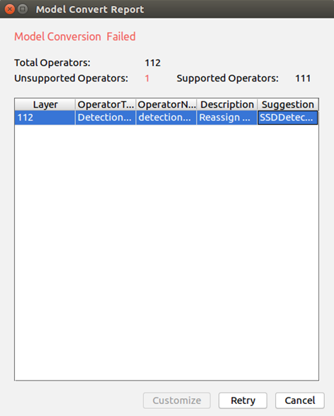
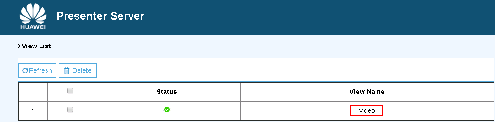

中文|[English](Readme_EN.md)

**该案例仅仅用于学习，打通流程，不对效果负责，不支持商用。**

# 头部姿势估计（Python）

开发者将本应用部署至Atlas 200 DK或者AI加速云服务器上实现对本地mp4文件或者RTSP视频流进行解码，对视频帧中的人脸图像进行头部姿势估计，并将预测的结果信息发送至Presenter Server端进行展示。

当前分支中的应用适配**1.3.0.0**与**1.32.0.0及以上**版本的[DDK&RunTime](https://ascend.huawei.com/resources)。

## 前提条件

部署此Sample前，需要准备好以下环境：

-   已完成Mind Studio的安装。

-   已完成Atlas 200 DK开发者板与Mind Studio的连接，SD卡的制作、编译环境的配置等。
-   由于需要配置开发板联网，默认设置为USB连接，开发板地址为192.168.1.2

## 软件准备

运行此应用前，需要按照此章节进行相关的环境配置并获取源码包。

1.  获取源码包。
    1.  下载压缩包方式获取。

        将[https://gitee.com/ascend/samples/tree/1.32.0.0/sample-headposeestimation-python](https://gitee.com/ascend/samples/tree/1.32.0.0/sample-headposeestimation-python)仓中的代码以Mind Studio安装用户下载至Mind Studio所在Ubuntu服务器的任意目录，例如代码存放路径为：$HOME/sample-headposeestimation-python。

    2.  命令行使用git命令方式获取。

        在命令行中：$HOME/AscendProjects目录下执行以下命令下载代码。

        **git clone https://gitee.com/Atlas200DK/sample-headposeestimation-python.git**

2.  获取此应用中所需要的网络模型。

    参考[表 头部姿势识别\(python\)使用模型](#zh-cn_topic_0228757086_table1119094515272)获取此应用中所用到的原始网络模型及其对应的权重文件，并将其存放到Mind Studio所在Ubuntu服务器的任意目录，例如：$HOME/ascend/models/headposeestimation-python。

    **表 1**  头部姿势识别\(python\)使用模型

    
    <table><thead align="left"><tr id="zh-cn_topic_0228757086_row677354502719"><th class="cellrowborder" valign="top" width="12.85%" id="mcps1.2.4.1.1">
模型名称

    </th>
    <th class="cellrowborder" valign="top" width="12.04%" id="mcps1.2.4.1.2">
模型说明

    </th>
    <th class="cellrowborder" valign="top" width="75.11%" id="mcps1.2.4.1.3">
模型下载路径

    </th>
    </tr>
    </thead>
    <tbody><tr id="zh-cn_topic_0228757086_row3122314144215"><td class="cellrowborder" valign="top" width="12.85%" headers="mcps1.2.4.1.1 ">
face_detection

    </td>
    <td class="cellrowborder" valign="top" width="12.04%" headers="mcps1.2.4.1.2 ">
人脸检测网络模型。

    
此模型是基于Caffe的Resnet10-SSD300模型转换后的网络模型。

    </td>
    <td class="cellrowborder" valign="top" width="75.11%" headers="mcps1.2.4.1.3 ">
请参考<a href="https://gitee.com/HuaweiAscend/models/tree/master/computer_vision/object_detect/face_detection" target="_blank" rel="noopener noreferrer">https://gitee.com/HuaweiAscend/models/tree/master/computer_vision/object_detect/face_detection</a>目录中README.md下载原始网络模型文件及其对应的权重文件。

    </td>
    </tr>
    <tr id="zh-cn_topic_0228757086_row1517495918114"><td class="cellrowborder" valign="top" width="12.85%" headers="mcps1.2.4.1.1 ">
head_pose_estimation

    </td>
    <td class="cellrowborder" valign="top" width="12.04%" headers="mcps1.2.4.1.2 ">
头部姿势估计网络模型。此模型是基于Caffe的VGG-SSD模型转换后的网络模型

    </td>
    <td class="cellrowborder" valign="top" width="75.11%" headers="mcps1.2.4.1.3 ">
请参考<a href="https://gitee.com/HuaweiAscend/models/tree/master/computer_vision/object_detect/head_pose_estimation" target="_blank" rel="noopener noreferrer">https://gitee.com/HuaweiAscend/models/tree/master/computer_vision/object_detect/head_pose_estimation</a>目录中README.md下载原始网络模型文件及其对应的权重文件。

    </td>
    </tr>
    </tbody>
    </table>

3.  将原始网络模型转换为适配昇腾AI处理器的模型。
    1.  在Mind Studio操作界面的顶部菜单栏中选择**Tools \> Model Convert**，进入模型转换界面。
    2.  在弹出的**Model Conversion**操作界面中，Model File与Weight File分别选择[步骤2](#zh-cn_topic_0228757086_li12291771229)中下载的模型文件和权重文件。
        -   **Model Name**填写为[表 检测网络应用\(python\)使用模型](#zh-cn_topic_0228757086_table1119094515272)对应的**模型名称**。
        -   face\_detection和head\_pose\_estimation模型都需要将**Input Image Format**更换为**RGB888\_U8**。并在AIPP配置界面将**Model Image Format**关闭。
        -   其他保持默认值。
        -   face\_detection模型在转换时会失败，报错如[图 face\_detection模型转换失败](#zh-cn_topic_0228757086_fig149226521166)所示。

            **图 1**  face\_detection模型转换失败  
            

            此时在**DetectionOutput**层的**Suggestion**中选择**SSDDetectionOutput**，并点击**Retry**。

    3.  单击OK开始转换模型。

        1.1.0.0和1.3.0.0版本模型转换成功后，后缀为.om的离线模型存放地址为：**$HOME/tools/che/model-zoo/my-model/xxx**。

        1.32.0.0及以上版本模型转换成功后，后缀为.om的离线模型存放地址为：**$HOME/modelzoo/xxx/device/xxx.om**。

    4.  将转换好的模型文件（.om文件）上传到[步骤1](#zh-cn_topic_0228757086_li953280133816)中源码所在路径下的“sample-headposeestimation-python/model”目录下。

4.  以Mind Studio安装用户登录Mind Studio所在Ubuntu服务器，并设置环境变量DDK\_HOME。

    **vim \~/.bashrc**

    1.  1.3.0.0版本执行如下命令在最后一行添加DDK\_HOME及LD\_LIBRARY\_PATH的环境变量。

        **export DDK\_HOME=$HOME/tools/che/ddk/ddk**

        **export LD\_LIBRARY\_PATH=$DDK\_HOME/uihost/lib**

    2.  1.32.0.0及以上版本执行如下命令在最后一行添加环境变量

        **export tools\_version=_1.32.X.X_**

        **export DDK\_HOME= \\$HOME/.mindstudio/huawei/ddk/\\$tools\_version/ddk**

        **export LD\_LIBRARY\_PATH= \\$DDK\_HOME/lib/x86\_64-linux-gcc5.4:\\$DDK\_HOME/uihost/lib**

    > **说明：**   
    >-   1.32.0.0及以上版本环境变量设置时1.32.X.X为DDK版本号，可以通过安装的DDK的包名获取，如DDK包的包名为Ascend\_DDK-1.32.0.B080-1.1.1-x86\_64.ubuntu16.04.tar.gz，则此DDK的版本号为1.32.0.B080。  
    >-   如果此环境变量已经添加，则此步骤可跳过。  

    输入:wq!保存退出。

    执行如下命令使环境变量生效。

    **source \~/.bashrc**

## 环境配置

**注：开发板上hiai库、opencv库、相关依赖已安装可跳过此步骤。**

1.  配置开发板联网。

    请参考[https://gitee.com/Atlas200DK/sample-README/tree/master/DK\_NetworkConnect](https://gitee.com/Atlas200DK/sample-README/tree/master/DK_NetworkConnect)  ，进行开发板网络连接配置。

2.  安装环境依赖。、

    请参考[https://gitee.com/Atlas200DK/sample-README/tree/master/DK\_Environment](https://gitee.com/Atlas200DK/sample-README/tree/master/DK_Environment)  ，进行环境依赖配置。

## 部署

1.  以Mind Studio安装用户进入headposeestimation-python应用代码所在根目录，如：$HOME/sample-headposeestimation-python。
2.  执行部署脚本，进行工程环境准备，Presenter Server服务器的配置等操作，其中Presenter Server用于接收Application发送过来的数据并通过浏览器进行结果展示。

    **bash deploy.sh** _host\_ip_

    -   _host\_ip_：Atlas 200 DK开发者板的IP地址。

    命令示例：

    **bash deploy.sh 192.168.1.2**

    当提示“Please choose one to show the presenter in browser\(default: 127.0.0.1\):“时，请输入在浏览器中访问Presenter Server服务所使用的IP地址（一般为虚拟网卡的IP地址。）

    请在“Current environment valid ip list“中选择通过浏览器访问Presenter Server服务使用的IP地址。

3.  启动Presenter Server。

    执行如下命令在后台启动Head Poseestimation应用的Presenter Server主程序。

    **bash start\_presenterserver.sh**

    > **说明：**   
    >-   执行此脚本会先杀死后台的其他Presenter Server进程。后台无正在执行的进程会提示presenter server not in process；后台有正在执行的进程会提示presenter server stop success。  
    >-   程序运行结束后可执行  **bash stop\_presenterserver.sh**  关闭presentserver。  

    如[图 Presenter Server进程启动](#zh-cn_topic_0228757086_fig69531305324)所示，表示presenter\_server的服务启动成功。

    **图 2**  Presenter Server进程启动  
    

    使用上图提示的URL登录Presenter Server。IP地址为[步骤2](#zh-cn_topic_0228757086_li9634105881418)中输入的IP地址，端口号默为7007，如下图所示，表示Presenter Server启动成功。

    **图 3**  主页显示  
    

    Presenter Server、Mind Studio与Atlas 200 DK之间通信使用的IP地址示例如下图所示：

    **图 4**  IP地址示例  
    

    其中：

    -   Atlas 200 DK开发者板使用的IP地址为192.168.1.2（USB方式连接）。
    -   Presenter Server与Atlas 200 DK通信的IP地址为UI Host服务器中与Atlas 200 DK在同一网段的IP地址，例如：192.168.1.223。
    -   通过浏览器访问Presenter Server的IP地址本示例为：10.10.0.1，由于Presenter Server与Mind Studio部署在同一服务器，此IP地址也为通过浏览器访问Mind Studio的IP。

4.  headposeestimation-python应用支持解析本地视频和RTSP视频流。
    -   如果需要解析本地视频，需要将视频文件传到Host侧。

        例如将视频文件headpose.mp4上传到Host侧的“/home/HwHiAiUser/sample“目录下。

        > **说明：**   
        >支持H264与H265格式的MP4文件，如果MP4文件需要剪辑，建议使用开源工具ffmpeg，使用其他工具剪辑的视频文件ffmpeg工具可能不支持解析。  

    -   如果仅解析RTSP视频流，本步骤可跳过。

## 运行

1.  在Mind Studio所在Ubuntu服务器中，以HwHiAiUser用户SSH登录到Host侧。

    **ssh HwHiAiUser@192.168.1.2**

2.  在HwHiAiUser用户下进入应用代码所在目录。

    **cd \~/HIAI\_PROJECTS/headposeestimationapp**

3.  执行应用程序。

    **python main.py** _channel_

    -   channel: 输入的视频文件名或者RTSP流地址

    视频文件运行的命令示例如下所示：

    **python main.py /home/HwHiAiUser/sample/headpose.mp4**

    RTSP视频流的命令示例如下所示：

    **python main.py rtsp://192.168.2.37:554/cam/realmonitor?channel=1&subtype=0**

    > **说明：**   
    >可使用ctrl+c停止程序  

4.  使用启动Presenter Server服务时提示的URL登录 Presenter Server 网站。

    等待Presenter Agent传输数据给服务端，单击“Refresh“刷新，当有数据时相应的Channel 的Status变成绿色，如[图 Presenter Server界面](#zh-cn_topic_0228757086_fig113691556202312)所示。

    **图 5**  Presenter Server界面  
    

    > **说明：**   
    >-   Presenter Server最多支持10路Channel同时显示，每个  _presenter\_view\_app\_name_  对应一路Channel。  
    >-   由于硬件的限制，每一路支持的最大帧率是20fps，受限于网络带宽的影响，帧率会自动适配为较低的帧率进行展示。  

5.  单击右侧对应的View Name链接，比如上图的“video”，查看结果。

