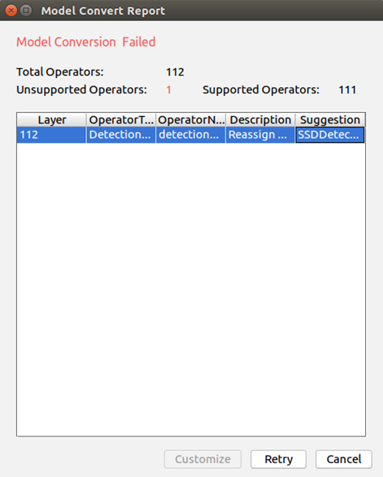

English|[中文](Readme.md)

**This case is only used for learning. It is not responsible for the effect and does not support commercial use.**

# Head Pose Estimation \(Python\)

This application can run on the Atlas 200 DK or the AI acceleration cloud server to decode local MP4 files or RTSP video streams, predict the head poses in the face images in video frames, and send the results to the Presenter Server for storage and display.

The current application adapts to  [DDK&RunTime](https://ascend.huawei.com/resources)  of 1.3.0.0 as well as 1.32.0.0 and later versions.

## Prerequisites

Before deploying this sample, ensure that:

-   Mind Studio  has been installed.

-   The Atlas 200 DK developer board has been connected to  Mind Studio, the SD card has been created, and the build environment has been configured.
-   The developer board is connected to the Internet over the USB port by default. The IP address of the developer board is  **192.168.1.2**.

## Software Preparation

Before running this application, obtain the source code package and configure the environment as follows.

1.  Obtain the source code package.
    1.  By downloading the package

        Download all code in the repository at  [https://gitee.com/ascend/samples/tree/1.32.0.0/sample-headposeestimation-python](https://gitee.com/ascend/samples/tree/1.32.0.0/sample-headposeestimation-python)  to any directory on Ubuntu Server where  Mind Studio  is located as the  Mind Studio  installation user, for example,  **$HOME/sample-headposeestimation-python.**

    2.  By running the  **git**  command

        Run the following command in the  **$HOME/AscendProjects**  directory to download code:

        **git clone https://gitee.com/Atlas200DK/sample-headposeestimation-python.git**

2.  Obtain the network model required by the application.

    Refer to  [Table 1](#en-us_topic_0228757086_table1119094515272)  to obtain the source network model used in this application and the corresponding weight file. Save them to any directory of the Ubuntu server with  Mind Studio  installed, for example,  **$HOME/ascend/models/headposeestimation-python**.

    **Table  1**  Models used in the head pose estimation \(Python\) application

    
    <table><thead align="left"><tr id="en-us_topic_0228757086_row677354502719"><th class="cellrowborder" valign="top" width="20.202020202020204%" id="mcps1.2.4.1.1">
Model Name

    </th>
    <th class="cellrowborder" valign="top" width="30.303030303030305%" id="mcps1.2.4.1.2">
Description

    </th>
    <th class="cellrowborder" valign="top" width="49.494949494949495%" id="mcps1.2.4.1.3">
Download Path

    </th>
    </tr>
    </thead>
    <tbody><tr id="en-us_topic_0228757086_row3122314144215"><td class="cellrowborder" valign="top" width="20.202020202020204%" headers="mcps1.2.4.1.1 ">
face_detection

    </td>
    <td class="cellrowborder" valign="top" width="30.303030303030305%" headers="mcps1.2.4.1.2 ">
Network model for face detection.

    
It is converted from the Caffe-based ResNet10-SSD300 model.

    </td>
    <td class="cellrowborder" valign="top" width="49.494949494949495%" headers="mcps1.2.4.1.3 ">
Download the source network model file and its weight file by referring to <strong id="en-us_topic_0228757086_b18555814135410">README.md</strong> at <a href="https://gitee.com/HuaweiAscend/models/tree/master/computer_vision/object_detect/face_detection" target="_blank" rel="noopener noreferrer">https://gitee.com/HuaweiAscend/models/tree/master/computer_vision/object_detect/face_detection</a>.

    </td>
    </tr>
    <tr id="en-us_topic_0228757086_row1517495918114"><td class="cellrowborder" valign="top" width="20.202020202020204%" headers="mcps1.2.4.1.1 ">
head_pose_estimation

    </td>
    <td class="cellrowborder" valign="top" width="30.303030303030305%" headers="mcps1.2.4.1.2 ">
Network model for head pose estimation. It is converted from the Caffe-based VGG-SSD model.

    </td>
    <td class="cellrowborder" valign="top" width="49.494949494949495%" headers="mcps1.2.4.1.3 ">
Download the source network model file and its weight file by referring to <strong id="en-us_topic_0228757086_b17860131555415">README.md</strong> at <a href="https://gitee.com/HuaweiAscend/models/tree/master/computer_vision/object_detect/head_pose_estimation" target="_blank" rel="noopener noreferrer">https://gitee.com/HuaweiAscend/models/tree/master/computer_vision/object_detect/head_pose_estimation</a>.

    </td>
    </tr>
    </tbody>
    </table>

3.  Convert the source network model to a model supported by the Ascend AI processor.
    1.  Choose  **Tools \> Model Convert**  from the main menu of  Mind Studio.
    2.  On the  **Model Conversion**  page, set  **Model File**  and  **Weight File**  to the model file and weight file downloaded in  [Step 2](#en-us_topic_0228757086_li12291771229), respectively.
        -   Set  **Model Name**  to the model name in  [Table 1](#en-us_topic_0228757086_table1119094515272).
        -   For the face\_detection and head\_pose\_estimation models, modify  **Input Image Format**  to  **RGB888\_U8**. On the  **AIPP **configuration page, disable** Model Image Format**.
        -   Retain the default values for other parameters.
        -   An error is reported when the face\_detection model fails to be converted, as shown in  [Figure 1](#en-us_topic_0228757086_fig149226521166).

            **Figure  1**  Model conversion failed  
            

            Select  **SSDDetectionOutput**  from the  **Suggestion**  drop-down list box at the  **DetectionOutput**  layer and click  **Retry**.

    3.  Click  **OK**  to start model conversion.

        After a model of 1.1.0.0 or 1.3.0.0 version is successfully converted, a .om offline model is generated in the  **$HOME/tools/che/model-zoo/my-model/xxx**  directory.

        After a model of 1.31.0.0 or a later version is successfully converted, an .om offline model is generated in the  **$HOME/modelzoo/xxx/device/_xxx_.om**  directory.

    4.  Upload the converted .om model file to the  **sample-headposeestimation-python/model**  directory under the source code path in  [Step 1](#en-us_topic_0228757086_li953280133816).

4.  Log in to Ubuntu Server where  Mind Studio  is located as the  Mind Studio  installation user and set the environment variable  **DDK\_HOME**.

    **vim \~/.bashrc**

    1.  For the 1.3.0.0 version, run the following commands to add the environment variables  **DDK\_HOME**  and  **LD\_LIBRARY\_PATH**  to the last line:

        **export DDK\_HOME=$HOME/tools/che/ddk/ddk**

        **export LD\_LIBRARY\_PATH=$DDK\_HOME/uihost/lib**

    2.  For 1.32.0.0 or later, run the following commands to append the environment variables:

        **export tools\_version=_1.32.X.X_**

        **export DDK\_HOME= \\$HOME/.mindstudio/huawei/ddk/\\$tools\_version/ddk**

        **export LD\_LIBRARY\_PATH= \\$DDK\_HOME/lib/x86\_64-linux-gcc5.4:\\$DDK\_HOME/uihost/lib**

    > **NOTE:**   
    >-   For 1.32.0.0 or later,  **1.32.X.X**  indicates the DDK version, which can be obtained from the DDK package name. For example, if the DDK package name is  **Ascend\_DDK-1.32.0.B080-1.1.1-x86\_64.ubuntu16.04.tar.gz**, the DDK version is  **1.32.0.B080**.  
    >-   If the environment variables have been added, skip this step.  

    Type  **:wq!**  to save settings and exit.

    Run the following command for the environment variable to take effect:

    **source \~/.bashrc**

## Environment Settings

Note: If the HiAI library, OpenCV library, and related dependencies have been installed on the developer board, skip this step.

1.  Configure the network connection of the developer board.

    Configure the network connection of the Atlas DK developer board by referring to  [https://gitee.com/Atlas200DK/sample-README/tree/master/DK\_NetworkConnect](https://gitee.com/Atlas200DK/sample-README/tree/master/DK_NetworkConnect).

2.  Install the environment dependencies. 

    Configure the environment dependency by referring to  [https://gitee.com/Atlas200DK/sample-README/tree/master/DK\_Environment](https://gitee.com/Atlas200DK/sample-README/tree/master/DK_Environment).

## Deployment

1.  Go to the root directory where the headposeestimation-python application code is located as the  Mind Studio  installation user, for example,  **$HOME/sample-headposeestimation-python**.
2.  Run the deployment script to prepare the project environment, including configuring Presenter Server. Presenter Server is used to receive the data sent by the application and display the result through the browser.

    **bash deploy.sh** _host\_ip_

    -   _host\_ip_: indicates the IP address of the Atlas 200 DK developer board.

    Command example:

    **bash deploy.sh 192.168.1.2**

    When the message  **Please choose one to show the presenter in browser\(default: 127.0.0.1\):**  is displayed, enter the IP address used for accessing the Presenter Server service in the browser. Generally, the IP address is that configured for the virtual NIC.

    Select the IP address used by the browser to access the Presenter Server service in  **Current environment valid ip list**.

3.  Start Presenter Server.

    Run the following command to start the Presenter Server program of the head pose estimation application in the background:

    **bash start\_presenterserver.sh**

    > **NOTE:**   
    >-   Running this script will kill other Presenter Server processes on the server. If no process is running on the background, the message "presenter server not in process" is displayed. If a process is running in the background, the message "presenter server stop success" is displayed.  
    >-   After the application is stopped, you can run the  **bash stop\_presenterserver.sh**  command to stop Presenter Server.  

    If the information shown in  [Figure 2](#en-us_topic_0228757086_fig69531305324)  is displayed, the Presenter Server service has been started successfully.

    **Figure  2**  Starting the Presenter Server process  
    

    Use the URL shown in the preceding figure to log in to Presenter Server. The IP address is that typed in  [Step 2](#en-us_topic_0228757086_li9634105881418)  and the default port number is  **7007**. The following figure indicates that Presenter Server has been started successfully.

    **Figure  3**  Home page  
    

    The following figure shows the IP address used by Presenter Server and  Mind Studio  to communicate with the Atlas 200 DK.

    **Figure  4**  IP address example  
    

    In the figure:

    -   The IP address of the Atlas 200 DK developer board is  **192.168.1.2**  \(connected in USB mode\).
    -   The IP address used by Presenter Server to communicate with the Atlas 200 DK is in the same network segment as the IP address of the Atlas 200 DK on the UI Host server, for example,  **192.168.1.223**.
    -   The following describes how to access the IP address \(such as  **10.10.0.1**\) of Presenter Server using a browser. Because Presenter Server and  Mind Studio  are deployed on the same server, you can access  Mind Studio  through the browser using the same IP address.

4.  Parse local videos and RTSP video streams using the headposeestimation-python application.
    -   To parse a local video, upload the video file to the host.

        For example, upload the video file  **headpose.mp4**  to the  **/home/HwHiAiUser/sample**  directory on the host.

        > **NOTE:**   
        >H.264 and H.265 MP4 files are supported. If an MP4 file needs to be edited, you are advised to use FFmpeg. If a video file is edited by other tools, FFmpeg may fail to parse the file.  

    -   If only RTSP video streams need to be parsed, skip this step.

## Run

1.  Log in to the host side as the  **HwHiAiUser**  user in SSH mode on Ubuntu Server where  Mind Studio  is located.

    **ssh HwHiAiUser@192.168.1.2**

2.  Go to the directory where the application code is stored as the  **HwHiAiUser**  user.

    **cd \~/HIAI\_PROJECTS/headposeestimationapp**

3.  Run the application.

    **python main.py** _channel_

    -   _channel_: input video file name or RTSP stream address

    The following is a command example for running video files:

    **python main.py /home/HwHiAiUser/sample/headpose.mp4**

    The following is a command example for running RTSP video streams:

    **python main.py rtsp://192.168.2.37:554/cam/realmonitor?channel=1&subtype=0**

    > **NOTE:**   
    >You can press  **Ctrl**+**C**  to stop the program.  

4.  Use the URL displayed upon the start of the Presenter Server service to log in to Presenter Server.

    Wait for Presenter Agent to transmit data to the server. Click  **Refresh**. When there is data, the icon in the  **Status**  column for the corresponding channel changes to green, as shown in  [Figure 5](#en-us_topic_0228757086_fig113691556202312).

    **Figure  5**  Presenter Server page  
    

    > **NOTE:**   
    >-   The Presenter Server supports a maximum of 10 channels at the same time \(each  _presenter\_view\_app\_name_  parameter corresponds to a channel\).  
    >-   Due to hardware limitations, each channel supports a maximum frame rate of 20 fps. A lower frame rate is automatically used when the network bandwidth is low.  

5.  Click a link in the  **View Name**  column, for example,  **video**  in the preceding figure, and view the result.

