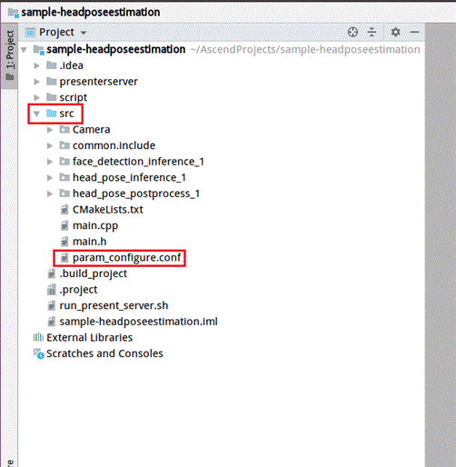
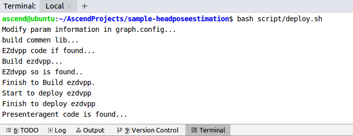
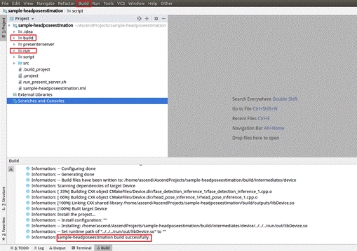
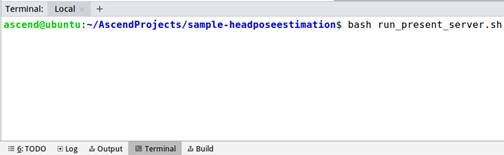
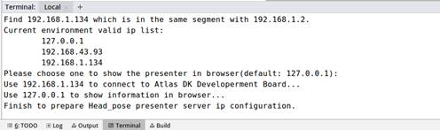
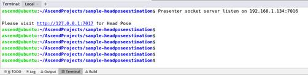
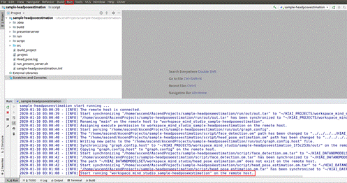
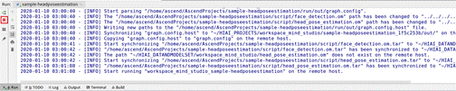
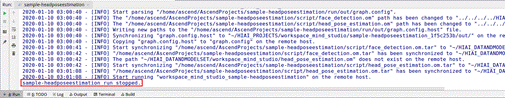

English|[中文](Readme.md)

**This case is only used for learning. It is not responsible for the effect and does not support commercial use.**

# Head Pose Estimation<a name="EN-US_TOPIC_0232635684"></a>

This application can run on the Atlas 200 DK to collect camera data in real time and predict head pose information in the video.

The applications in the current version branch adapt to  [DDK&RunTime](https://ascend.huawei.com/resources) **1.32.0.0 and later**.

## Prerequisites<a name="en-us_topic_0219099583_section137245294533"></a>

Before deploying this sample, ensure that:

-   Mind Studio  has been installed.
-   The Atlas 200 DK developer board has been connected to  Mind Studio, the cross compiler has been installed, the SD card has been prepared, and basic information has been configured.

## Software Preparation<a name="en-us_topic_0219099583_section081240125311"></a>

Before running this sample, obtain the source code package, configure the environment, and prepare a model file as follows:

1.  <a name="en-us_topic_0219099583_li953280133816"></a>Obtain the source code package.
    1.  By downloading the package

        Download all the code in the repository at  [https://gitee.com/Atlas200DK/sample-headposeestimation](https://gitee.com/Atlas200DK/sample-headposeestimation)  to any directory on Ubuntu Server where Mind Studio is located as the Mind Studio installation user, for example,  **$HOME/AscendProjects/sample-headposeestimation**.

    2.  By running the  **git**  command

        Run the following command in the  **$HOME/AscendProjects**  directory to download code:

        **git clone https://gitee.com/Atlas200DK/sample-headposeestimation.git**

2.  <a name="en-us_topic_0219099583_li1365682471610"></a>Obtain the source network model required by the application.

    Obtain the source network model and its weight file used in the application by referring to  [Table 1](#en-us_topic_0219099583_table144841813177)  and save them to the same directory on Ubuntu Server where  Mind Studio  is located, for example,  **$HOME/models/headposeestimation**.

    **Table  1**  Models used in the head pose estimation application

    <a name="en-us_topic_0219099583_table144841813177"></a>
    <table><thead align="left"><tr id="en-us_topic_0219099583_row161061318181712"><th class="cellrowborder" valign="top" width="14.000000000000002%" id="mcps1.2.4.1.1"><p id="en-us_topic_0219099583_p1410671814173"><a name="en-us_topic_0219099583_p1410671814173"></a><a name="en-us_topic_0219099583_p1410671814173"></a>Model Name</p>
    </th>
    <th class="cellrowborder" valign="top" width="23%" id="mcps1.2.4.1.2"><p id="en-us_topic_0219099583_p1106118121716"><a name="en-us_topic_0219099583_p1106118121716"></a><a name="en-us_topic_0219099583_p1106118121716"></a>Description</p>
    </th>
    <th class="cellrowborder" valign="top" width="63%" id="mcps1.2.4.1.3"><p id="en-us_topic_0219099583_p14106218121710"><a name="en-us_topic_0219099583_p14106218121710"></a><a name="en-us_topic_0219099583_p14106218121710"></a>Download Path</p>
    </th>
    </tr>
    </thead>
    <tbody><tr id="en-us_topic_0219099583_row1710661814171"><td class="cellrowborder" valign="top" width="14.000000000000002%" headers="mcps1.2.4.1.1 "><p id="en-us_topic_0219099583_p17921089115"><a name="en-us_topic_0219099583_p17921089115"></a><a name="en-us_topic_0219099583_p17921089115"></a>face_detection</p>
    </td>
    <td class="cellrowborder" valign="top" width="23%" headers="mcps1.2.4.1.2 "><p id="en-us_topic_0219099583_p6792386120"><a name="en-us_topic_0219099583_p6792386120"></a><a name="en-us_topic_0219099583_p6792386120"></a>Network model for face detection.</p>
    <p id="en-us_topic_0219099583_p4792386118"><a name="en-us_topic_0219099583_p4792386118"></a><a name="en-us_topic_0219099583_p4792386118"></a>It is converted from the Caffe-based ResNet10-SSD300 model.</p>
    </td>
    <td class="cellrowborder" valign="top" width="63%" headers="mcps1.2.4.1.3 "><p id="en-us_topic_0219099583_p1679248219"><a name="en-us_topic_0219099583_p1679248219"></a><a name="en-us_topic_0219099583_p1679248219"></a>Download the source network model file and its weight file by referring to<strong id="en-us_topic_0219099583_b939193404411"><a name="en-us_topic_0219099583_b939193404411"></a><a name="en-us_topic_0219099583_b939193404411"></a> README.md</strong> at <a href="https://gitee.com/HuaweiAscend/models/tree/master/computer_vision/object_detect/face_detection" target="_blank" rel="noopener noreferrer">https://gitee.com/HuaweiAscend/models/tree/master/computer_vision/object_detect/face_detection</a>.</p>
    </td>
    </tr>
    <tr id="en-us_topic_0219099583_row20991341914"><td class="cellrowborder" valign="top" width="14.000000000000002%" headers="mcps1.2.4.1.1 "><p id="en-us_topic_0219099583_p4792148315"><a name="en-us_topic_0219099583_p4792148315"></a><a name="en-us_topic_0219099583_p4792148315"></a>head_pose_estimation</p>
    </td>
    <td class="cellrowborder" valign="top" width="23%" headers="mcps1.2.4.1.2 "><p id="en-us_topic_0219099583_p479212818114"><a name="en-us_topic_0219099583_p479212818114"></a><a name="en-us_topic_0219099583_p479212818114"></a>Network model for head pose estimation. It is converted from the Caffe-based VGG-SSD model.</p>
    </td>
    <td class="cellrowborder" valign="top" width="63%" headers="mcps1.2.4.1.3 "><p id="en-us_topic_0219099583_p74491026916"><a name="en-us_topic_0219099583_p74491026916"></a><a name="en-us_topic_0219099583_p74491026916"></a>Download the source network model file and its weight file by referring to <strong id="en-us_topic_0219099583_b294518818454"><a name="en-us_topic_0219099583_b294518818454"></a><a name="en-us_topic_0219099583_b294518818454"></a>README.md</strong> at <a href="https://gitee.com/HuaweiAscend/models/tree/master/computer_vision/object_detect/head_pose_estimation" target="_blank" rel="noopener noreferrer">https://gitee.com/HuaweiAscend/models/tree/master/computer_vision/object_detect/head_pose_estimation</a>.</p>
    </td>
    </tr>
    </tbody>
    </table>

3.  Log in to Ubuntu Server where Mind Studio is located as the Mind Studio installation user, determine the current DDK version, and set the environment variables  **DDK\_HOME**,  **tools\_version**,  **NPU\_DEVICE\_LIB**, and  **LD\_LIBRARY\_PATH**.
    1.  <a name="en-us_topic_0219099583_li61417158198"></a>Query the current DDK version.

        A DDK version can be queried by using either Mind Studio or the DDK software package.

        -   Using Mind Studio

            On the project page of Mind Studio, choose  **File \> Settings \> System Settings \> Ascend DDK**  to query the DDK version, as shown in  [Figure 1](#en-us_topic_0219099583_fig17553193319118).

            **Figure  1**  Querying the DDK version<a name="en-us_topic_0219099583_fig17553193319118"></a>  
            

            The displayed  **DDK Version**  is the current DDK version, for example,  **1.32.0.B080**.

        -   Using the DDK software package

            Obtain the DDK version based on the DDK package name.

            DDK package name format:  **Ascend\_DDK-\{**_software version_**\}-\{**_interface version_**\}-x86\_64.ubuntu16.04.tar.gz**

            _Software version_  indicates the DDK software version.

            For example:

            If the DDK package name is  **Ascend\_DDK-1.32.0.B080-1.1.1-x86\_64.ubuntu16.04.tar.gz**, the DDK version is  **1.32.0.B080**.

    2.  Set environment variables.

        **vim \~/.bashrc**

        Run the following commands to add the environment variables  **DDK\_HOME**  and  **LD\_LIBRARY\_PATH**  to the last line:

        **export tools\_version=_1.32.X.X_**

        **export DDK\_HOME=$HOME/.mindstudio/huawei/ddk/_1.32.X.X_/ddk**

        **export LD\_LIBRARY\_PATH=$DDK\_HOME/lib/x86\_64-linux-gcc5.4**

        > **NOTE:**   
        >-   **_1.32.X.X_**  indicates the DDK version queried in  [a](#en-us_topic_0219099583_li61417158198). Set this parameter based on the query result, for example,  **1.32.0.B080**.  
        >-   If the environment variables have been added, skip this step.  

        Type  **:wq!**  to save settings and exit.

        Run the following command for the environment variable to take effect:

        **source \~/.bashrc**

4.  Convert the source network model to a model supported by the Ascend AI processor.
    -   Convert a model using Mind Studio.
        1.  Choose  **Tools \> Model Convert**  from the main menu of Mind Studio.
        2.  On the  **Model Conversion**  page that is displayed, configure model conversion.
            -   Select the model file downloaded in  [Step 2](#en-us_topic_0219099583_li1365682471610)  for  **Model File**. The weight file is automatically matched and filled in  **Weight File**.
            -   Set  **Model Name**  to the model name in  [Table 1](#en-us_topic_0219099583_table144841813177).
                1.  On the AIPP configuration page of the face\_detection model, set  **Model Image Format**  to  **BGR888\_U8**. Retain the default values for other parameters.
                2.  On the AIPP configuration page of the head\_pose\_estimation model, set  **Model Image Format**  to  **BGR888\_U8**. Retain the default values for other parameters.

        3.  During the conversion, the error information occurs with the face\_detection model, as shown in  [Figure 2](#en-us_topic_0219099583_fig2865313121718).

            **Figure  2**  Model conversion error<a name="en-us_topic_0219099583_fig2865313121718"></a>  
            

            

            Select  **SSDDetectionOutput**  from the  **Suggestion**  drop-down list box at the  **DetectionOutput**  layer and click  **Retry**.

            After successful conversion, an .om offline model is generated in the  **$HOME/modelzoo/xxx/device**  directory.

            > **NOTE:**   
            >For details about the descriptions of each step and parameters in model conversion, see "Model Conversion" in the  [Mind Studio User Guide](https://ascend.huawei.com/doc/mindstudio/).  


5.  Upload the converted .om model file to the  **sample-head\_pose\_estimation/script**  directory under the source code path in  [Step 1](#en-us_topic_0219099583_li953280133816).

## Build<a name="en-us_topic_0219099583_section7994174585917"></a>

1.  Open the project.

    Go to the directory that stores the decompressed installation package as the Mind Studio installation user in CLI mode, for example,  **$HOME/MindStudio-ubuntu/bin**. Run the following command to start Mind Studio:

    **./MindStudio.sh**

    Open the  **sample-headposeestimation**  project.

2.  Configure project information in the  **src/param\_configure.conf**  file.

    For details, see  [Figure 3](#en-us_topic_0219099583_fig0391184062214).

    **Figure  3**  Configuration file<a name="en-us_topic_0219099583_fig0391184062214"></a>  
    

    

    The default configurations of the configuration file are as follows:

    ```
    remote_host=192.168.1.2
    data_source=Channel-1
    presenter_view_app_name=video
    ```

    -   **remote\_host**: IP address of the Atlas 200 DK developer board
    -   **data\_source**: camera channel. The value can be  **Channel-1**  or  **Channel-2**. For details, see "Viewing the Channel to Which a Camera Belongs" in  [Atlas 200 DK User Guide](https://ascend.huawei.com/documentation).
    -   **presenter\_view\_app\_name**: value of  **View Name**  on the  **Presenter Server**  page, which must be unique. The value consists of at least one character and supports only uppercase letters, lowercase letters, digits, and underscores \(\_\).

    > **NOTE:**   
    >-   All the three parameters must be set. Otherwise, the build fails.  
    >-   Do not use double quotation marks \(""\) during parameter settings.  
    >-   Modify the default configurations as required.  

3.  Run the  **deploy.sh**  script to adjust configuration parameters and download and compile the third-party library. Open the  **Terminal**  window of Mind Studio. By default, the home directory of the code is used. Run the  **deploy.sh**  script in the background to deploy the environment, as shown in  [Figure 4](#en-us_topic_0219099583_fig4285173816445).

    **Figure  4**  Running the deploy.sh script<a name="en-us_topic_0219099583_fig4285173816445"></a>  
    

    > **NOTE:**   
    >-   During the first deployment, if no third-party library is used, the system automatically downloads and builds the third-party library, which may take a long time. The third-party library can be directly used for the subsequent build.  
    >-   During deployment, select the IP address of the host that communicates with the developer board. Generally, the IP address is that configured for the virtual NIC. If the IP address is in the same network segment as the IP address of the developer board, it is automatically selected for deployment. If they are not in the same network segment, you need to manually type the IP address of the host that communicates with the developer board to complete the deployment.  

4.  Start building. Open Mind Studio and choose  **Build \> Build \> Build-Configuration**  from the main menu. The  **build**  and  **run**  folders are generated in the directory, as shown in  [Figure 5](#en-us_topic_0219099583_fig1625447397).

    **Figure  5**  Build and files generated<a name="en-us_topic_0219099583_fig1625447397"></a>  
    

    

    > **NOTICE:**   
    >When you build a project for the first time,  **Build \> Build**  is unavailable. You need to choose  **Build \> Edit Build Configuration**  to set parameters before the build.  

5.  Start Presenter Server.

    Open the  **Terminal**  tab page of Mind Studio. By default, under the code storage path, run the following command to start the Presenter Server program of the head pose estimation application on the server, as shown in  [Figure 6](#en-us_topic_0219099583_fig423515251067).

    **bash run\_present\_server.sh**

    **Figure  6**  Starting Presenter Server<a name="en-us_topic_0219099583_fig423515251067"></a>  
    

    

    When the message  **Please choose one to show the presenter in browser\(default: 127.0.0.1\):**  is displayed, type the IP address \(usually IP address for accessing Mind Studio\) used for accessing the Presenter Server service in the browser.

    Select the IP address used by the browser to access the Presenter Server service in  **Current environment valid ip list**, as shown in  [Figure 7](#en-us_topic_0219099583_fig999812514814).

    **Figure  7**  Project deployment<a name="en-us_topic_0219099583_fig999812514814"></a>  
    

    

    [Figure 8](#en-us_topic_0219099583_fig69531305324)  shows that the Presenter Server service has been started successfully.

    **Figure  8**  Starting the Presenter Server process<a name="en-us_topic_0219099583_fig69531305324"></a>  
    

    

    Use the URL shown in the preceding figure to log in to Presenter Server. The IP address is that typed in  [Figure 7](#en-us_topic_0219099583_fig999812514814)  and the default port number is  **7007**. The following figure indicates that Presenter Server has been started successfully.

    **Figure  9**  Home page<a name="en-us_topic_0219099583_fig64391558352"></a>  
    

    The following figure shows the IP address used by Presenter Server and  Mind Studio  to communicate with the Atlas 200 DK.

    **Figure  10**  IP address example<a name="en-us_topic_0219099583_fig1881532172010"></a>  
    

    In the figure:

    -   The IP address of the Atlas 200 DK developer board is  **192.168.1.2**  \(connected in USB mode\).
    -   The IP address used by Presenter Server to communicate with the Atlas 200 DK is in the same network segment as the IP address of the Atlas 200 DK on the UI Host server, for example,  **192.168.1.223**.
    -   The following describes how to access the IP address \(such as  **10.10.0.1**\) of Presenter Server using a browser. Because Presenter Server and  Mind Studio  are deployed on the same server, you can access  Mind Studio  through the browser using the same IP address. 


## Run<a name="en-us_topic_0219099583_section551710297235"></a>

1.  Run the head pose estimation program.

    On the toolbar of Mind Studio, click  **Run**  and choose  **Run \> Run 'sample-headposeestimation'**. As shown in  [Figure 11](#en-us_topic_0219099583_fig93931954162719), the executable application is running on the developer board.

    **Figure  11**  Application running sample<a name="en-us_topic_0219099583_fig93931954162719"></a>  
    

    

2.  Use the URL displayed upon the start of the Presenter Server service to log in to Presenter Server.

    Wait for Presenter Agent to transmit data to the server. Click  **Refresh**. When there is data, the icon in the  **Status**  column for the corresponding channel changes to green, as shown in  [Figure 12](#en-us_topic_0219099583_fig113691556202312).

    **Figure  12**  Presenter Server page<a name="en-us_topic_0219099583_fig113691556202312"></a>  
    

    > **NOTE:**   
    >-   For the head pose estimation application, Presenter Server supports a maximum of 10 channels at the same time \(each  _presenter\_view\_app\_name_  parameter corresponds to a channel\).  
    >-   Due to hardware limitations, each channel supports a maximum frame rate of 20 fps. A lower frame rate is automatically used when the network bandwidth is low.  

3.  Click the link \(such as  **video**  in the preceding figure\) in the  **View Name**  column to view the result. The confidence of the detected head pose is marked.

## Follow-up Operations<a name="en-us_topic_0219099583_section177619345260"></a>

-   Stopping the head pose estimation application

    The head pose estimation application is running continually after being executed. To stop it, perform the following operation:

    Click the stop button shown in  [Figure 13](#en-us_topic_0219099583_fig14326454172518)  to stop the head pose estimation application.

    **Figure  13**  Stopping the head pose estimation application<a name="en-us_topic_0219099583_fig14326454172518"></a>  
    

    

    [Figure 14](#en-us_topic_0219099583_fig2182182518112)  shows that the head pose estimation application has been stopped.

    **Figure  14**  Head pose estimation stopped<a name="en-us_topic_0219099583_fig2182182518112"></a>  
    

    

-   Stopping the Presenter Server service

    The Presenter Server service is always in running state after being started. To stop the Presenter Server service of the head pose estimation application, perform the following operations:

    On the server with  Mind Studio  installed, run the following command as the  Mind Studio  installation user to check the process of the Presenter Server service corresponding to the head pose estimation application:

    **ps -ef | grep presenter | grep headposeestimation**

    ```
    ascend@ascend-HP-ProDesk-600-G4-PCI-MT:~/sample-headposeestimation$ ps -ef | grep presenter | grep headposeestimation 
     ascend    7701  1615  0 14:21 pts/8    00:00:00 python3 presenterserver/presenter_server.py --app Head_pose
    ```

    In the preceding information,  _7701_  indicates the process ID of the Presenter Server service for the head pose estimation application.

    To stop the service, run the following command:

    **kill -9** _7701_


