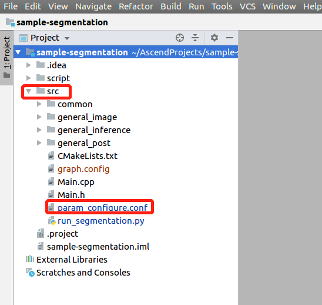
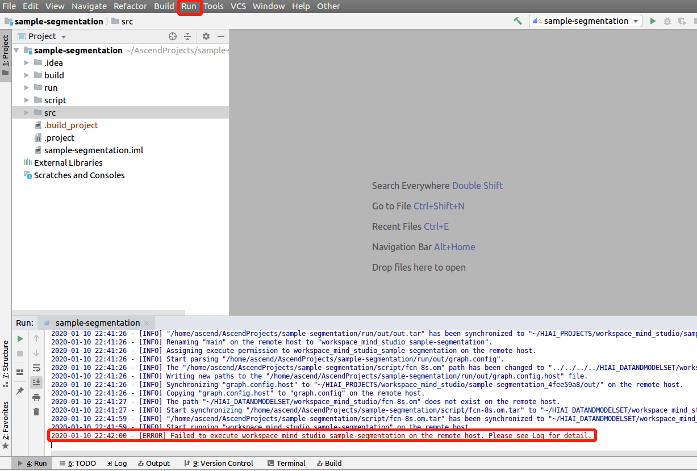

English|[中文](Readme.md)

**This case is only used for learning. It is not responsible for the effect and does not support commercial use.**

# Semantic Segmentation Network Application \(C++\)<a name="EN-US_TOPIC_0232634235"></a>

This application runs on the Atlas 200 DK or the AI acceleration cloud server to implement the inference function by using a semantic segmentation network.

The applications in the current version branch adapt to  [DDK&RunTime](https://ascend.huawei.com/resources) **1.32.0.0 and later**.

## Prerequisites<a name="en-us_topic_0219037582_section137245294533"></a>

Before deploying this sample, ensure that:

-   Mind Studio  has been installed.
-   The Atlas 200 DK developer board has been connected to  Mind Studio, the cross compiler has been installed, the SD card has been prepared, and basic information has been configured.

## Software Preparation<a name="en-us_topic_0219037582_section181111827718"></a>

Before running the sample, obtain the source code package and configure the environment as follows:

1.  <a name="en-us_topic_0219037582_li953280133816"></a>Obtain the source code package.
    1.  By downloading the package

        Download the code from the repository at  [https://gitee.com/Atlas200DK/sample-segmentation/tree/1.3x.0.0/](https://gitee.com/Atlas200DK/sample-segmentation/tree/1.3x.0.0/)  as the Mind Studio installation user to any directory on the Ubuntu server where Mind Studio is located. For example, the code can be stored in  **$HOME/AscendProjects/sample-segmentation**.

    2.  By running the  **git**  command

        Run the following command in the  **$HOME/AscendProjects**  directory to download code:

        **git clone https://gitee.com/Atlas200DK/sample-segmentation.git --branch 1.3x.0.0**

2.  <a name="en-us_topic_0219037582_li2074865610364"></a>Obtain the source network model required by the application.

    Obtain the source network model and its weight file used in the application by referring to  [Table 1](#en-us_topic_0219037582_table19942111763710)  and save them to the same directory on Ubuntu Server where  Mind Studio  is located, for example,  **$HOME/models/segmentation**.

    **Table  1**  Models used in a general semantic segmentation network application

    <a name="en-us_topic_0219037582_table19942111763710"></a>
    <table><thead align="left"><tr id="en-us_topic_0219037582_row611318123710"><th class="cellrowborder" valign="top" width="11.959999999999999%" id="mcps1.2.4.1.1"><p id="en-us_topic_0219037582_p81141820376"><a name="en-us_topic_0219037582_p81141820376"></a><a name="en-us_topic_0219037582_p81141820376"></a>Model Name</p>
    </th>
    <th class="cellrowborder" valign="top" width="8.07%" id="mcps1.2.4.1.2"><p id="en-us_topic_0219037582_p13181823711"><a name="en-us_topic_0219037582_p13181823711"></a><a name="en-us_topic_0219037582_p13181823711"></a>Description</p>
    </th>
    <th class="cellrowborder" valign="top" width="79.97%" id="mcps1.2.4.1.3"><p id="en-us_topic_0219037582_p1717182378"><a name="en-us_topic_0219037582_p1717182378"></a><a name="en-us_topic_0219037582_p1717182378"></a>Download Path</p>
    </th>
    </tr>
    </thead>
    <tbody><tr id="en-us_topic_0219037582_row1119187377"><td class="cellrowborder" valign="top" width="11.959999999999999%" headers="mcps1.2.4.1.1 "><p id="en-us_topic_0219037582_p2027020573255"><a name="en-us_topic_0219037582_p2027020573255"></a><a name="en-us_topic_0219037582_p2027020573255"></a>ERFNet</p>
    </td>
    <td class="cellrowborder" valign="top" width="8.07%" headers="mcps1.2.4.1.2 "><p id="en-us_topic_0219037582_p22704571258"><a name="en-us_topic_0219037582_p22704571258"></a><a name="en-us_topic_0219037582_p22704571258"></a>Caffe-based semantic segmentation model, an optional model of this application</p>
    </td>
    <td class="cellrowborder" valign="top" width="79.97%" headers="mcps1.2.4.1.3 "><p id="en-us_topic_0219037582_p3270135716250"><a name="en-us_topic_0219037582_p3270135716250"></a><a name="en-us_topic_0219037582_p3270135716250"></a>Download the source network model file and its weight file by referring to<strong id="en-us_topic_0219037582_b107405353372"><a name="en-us_topic_0219037582_b107405353372"></a><a name="en-us_topic_0219037582_b107405353372"></a> README.md</strong> at <a href="https://gitee.com/HuaweiAscend/models/tree/master/computer_vision/segmentation/erfnet" target="_blank" rel="noopener noreferrer">https://gitee.com/HuaweiAscend/models/tree/master/computer_vision/segmentation/erfnet</a>.</p>
    </td>
    </tr>
    <tr id="en-us_topic_0219037582_row1714516557254"><td class="cellrowborder" valign="top" width="11.959999999999999%" headers="mcps1.2.4.1.1 "><p id="en-us_topic_0219037582_p1927010574259"><a name="en-us_topic_0219037582_p1927010574259"></a><a name="en-us_topic_0219037582_p1927010574259"></a>FCN8s</p>
    </td>
    <td class="cellrowborder" valign="top" width="8.07%" headers="mcps1.2.4.1.2 "><p id="en-us_topic_0219037582_p13270135742510"><a name="en-us_topic_0219037582_p13270135742510"></a><a name="en-us_topic_0219037582_p13270135742510"></a>Caffe-based semantic segmentation model, an optional model of this application</p>
    </td>
    <td class="cellrowborder" valign="top" width="79.97%" headers="mcps1.2.4.1.3 "><p id="en-us_topic_0219037582_p1227065782511"><a name="en-us_topic_0219037582_p1227065782511"></a><a name="en-us_topic_0219037582_p1227065782511"></a>Download the source network model file and its weight file by referring to<strong id="en-us_topic_0219037582_b05921841193914"><a name="en-us_topic_0219037582_b05921841193914"></a><a name="en-us_topic_0219037582_b05921841193914"></a> README.md</strong> at <a href="https://gitee.com/HuaweiAscend/models/tree/master/computer_vision/segmentation/fcn-8s" target="_blank" rel="noopener noreferrer">https://gitee.com/HuaweiAscend/models/tree/master/computer_vision/segmentation/fcn-8s</a>.</p>
    </td>
    </tr>
    </tbody>
    </table>

3.  Log in to Ubuntu Server where Mind Studio is located as the Mind Studio installation user, confirm the current DDK version, and set the environment variables  **DDK\_HOME**,  **tools\_version**, and  **LD\_LIBRARY\_PATH**.
    1.  <a name="en-us_topic_0219037582_en-us_topic_0203223294_li61417158198"></a>Query the current DDK version.

        A DDK version can be queried by using either Mind Studio or the DDK software package.

        -   Using Mind Studio

            On the project page of Mind Studio, choose  **File \> Settings \> System Settings \> Ascend DDK**  to query the DDK version.

            **Figure  1**  Querying the DDK version<a name="en-us_topic_0219037582_en-us_topic_0203223294_fig17553193319118"></a>  
            

            The displayed  **DDK Version**  is the current DDK version, for example,  **1.32.0.B080**.

        -   Using the DDK software package

            Obtain the DDK version based on the DDK package name.

            DDK package name format:  **Ascend\_DDK-\{software version\}-\{interface version\}-x86\_64.ubuntu16.04.tar.gz**

            _Software version_  indicates the DDK software version.

            For example:

            If the DDK package name is  **Ascend\_DDK-1.32.0.B080-1.1.1-x86\_64.ubuntu16.04.tar.gz**, the DDK version is  **1.32.0.B080**.

    2.  Set environment variables.

        **vim \~/.bashrc**

        Run the following commands to add the environment variables  **DDK\_HOME**  and  **LD\_LIBRARY\_PATH**  to the last line:

        **export tools\_version=_1.32.X.X_**

        **export DDK\_HOME=\\$HOME/.mindstudio/huawei/ddk/\\$tools\_version/ddk**

        **export LD\_LIBRARY\_PATH=$DDK\_HOME/lib/x86\_64-linux-gcc5.4**

        > **NOTE:**   
        >-   **_1.32.X.X_**  indicates the DDK version queried in  [a](#en-us_topic_0219037582_en-us_topic_0203223294_li61417158198). Set this parameter based on the query result, for example,  **1.32.0.B080**.  
        >-   If the environment variables have been added, skip this step.  

        Type  **:wq!**  to save settings and exit.

        Run the following command for the environment variable to take effect:

        **source \~/.bashrc**

4.  Convert the source network model to a model supported by the Ascend AI processor.
    1.  Choose  **Tools \> Model Convert**  from the main menu of  Mind Studio.
    2.  On the  **Model Conversion**  page that is displayed, configure model conversion.
        -   Select the model file downloaded in  [Step 2](#en-us_topic_0219037582_li2074865610364)  for  **Model File**. The weight file is automatically matched and filled in  **Weight File**.
        -   Set  **Model Name**  to the model name in  [Table 1](#en-us_topic_0219037582_table19942111763710).
        -   During the conversion of the ERFNet and FCN8s models, set  **Input Image Size**  in the AIPP configuration to 128 x 16 alignment, set  **Model Image Format**  to  **BGR888\_U8**, and disable  **Mean Less\[B|G|R\]**. Use the default values for other parameters.

    3.  Click  **Finish**  to start model conversion.

        After successful conversion, an .om offline model is generated in the  **$HOME/modelzoo/XXX/device**  directory.

        > **NOTE:**   
        >-   For details about the descriptions of each step and parameters in model conversion on Mind Studio, see "Model Conversion" in the  [Mind Studio User Guide](https://ascend.huawei.com/doc/mindstudio/).  
        >-   **XXX**  indicates the name of the model to be converted. For example,  **erfnet.om**  is stored in  **$HOME/modelzoo/erfnet/device**.  


5.  <a name="en-us_topic_0219037582_li647582712452"></a>Upload the converted .om model file to the  **sample-segmentation/script**  directory under the source code path in  [Step 1](#en-us_topic_0219037582_li953280133816).

## Build<a name="en-us_topic_0219037582_section3723145213347"></a>

1.  Open the project.

    Go to the directory that stores the decompressed installation package as the Mind Studio installation user in CLI mode, for example,  **$HOME/MindStudio-ubuntu/bin**. Run the following command to start Mind Studio:

    **./MindStudio.sh**

    Open the  **sample-segmentation**  project, as shown in  [Figure 2](#en-us_topic_0219037582_fig9485154817568).

    **Figure  2**  Opening the segmentation project<a name="en-us_topic_0219037582_fig9485154817568"></a>  
    

    

2.  Configure project information in the  **src/param\_configure.conf**  file.

    **Figure  3**  Configuration file path<a name="en-us_topic_0219037582_fig1777213106583"></a>  
    

    

    The default configurations of the configuration file are as follows:

    ```
    remote_host=192.168.1.2 
    model_name=Fcn8s.om
    ```

    -   **remote\_host**: IP address of the Atlas 200 DK developer board
    -   **model\_name**: offline model name

    > **NOTE:**   
    >-   All the three parameters must be set. Otherwise, the build fails.  
    >-   Do not use double quotation marks \(""\) during parameter settings.  
    >-   Only one model name can be typed into the configuration file. The typed model must be one of the models stored in  [Step 5](#en-us_topic_0219037582_li647582712452). FCN8s is used as an example. You can use any of other models listed in this sample and execute it by performing the preceding steps.  
    >-   Modify the default configurations as required.  

3.  Run the  **deploy.sh**  script to adjust configuration parameters and download and compile the third-party library. Open the  **Terminal**  window of Mind Studio. By default, the home directory of the code is used. Run the  **deploy.sh**  script in the background to deploy the environment, as shown in  [Figure 4](#en-us_topic_0219037582_fig11388946153414).

    **Figure  4**  Running the deploy.sh script<a name="en-us_topic_0219037582_fig11388946153414"></a>  
    

    > **NOTE:**   
    >-   During the first deployment, if no third-party library is used, the system automatically downloads and compiles the third-party library, which may take a long time. The third-party library can be directly used for the subsequent compilation.  
    >-   During deployment, select the IP address of the host that communicates with the developer board. Generally, the IP address is the IP address configured for the virtual NIC. If the IP address is in the same network segment as the IP address of the developer board, it is automatically selected for deployment. If they are not in the same network segment, you need to manually type the IP address of the host that communicates with the Atlas DK to complete the deployment.  

4.  Start the build. Open Mind Studio and choose  **Build \> Build \> Build-Configuration**  from the main menu. The  **build**  and  **run**  folders are generated in the directory, as shown in  [Figure 5](#en-us_topic_0219037582_fig1487710597597).

    **Figure  5**  Build and file generation<a name="en-us_topic_0219037582_fig1487710597597"></a>  
    

    

    Notes:

    When you build a project for the first time,  **Build \> Build**  is unavailable. You need to choose  **Build \> Edit Build Configuration**  to set parameters before the build.

    

5.  Copy the image to be inferred to the  **$HOME/AscendProjects/sample-segmentation/run/out**  directory.

    The FCN model is tested using the sample images in the  **/sample-segmentation/ImageNetRaw**  folder, and the ERFNet model is tested using the sample images in the  **/sample-segmentation/ImageCity**  folder. Copy the required folder to the corresponding location on the developer board.

    The image requirements are as follows:

    -   Format: jpg, png, and bmp
    -   Width of the input image: an integer ranging from 16px to 4096px
    -   Height of the input image: an integer ranging from 16px to 4096px


## Run<a name="en-us_topic_0219037582_section1620073406"></a>

1.  On the toolbar of Mind Studio, click  **Run**  and choose  **Run \> Run 'sample-segmentation'**. As shown in  [Figure 6](#en-us_topic_0219037582_fig18918132273612), the executable application is running on the developer board.

    **Figure  6**  Running application<a name="en-us_topic_0219037582_fig18918132273612"></a>  
    

    

    You can ignore the error information reported during the execution because Mind Studio cannot transfer parameters for an executable application. In the preceding steps, the executable application and dependent library files are deployed to the developer board. You need to log in to the developer board in SSH mode and manually execute the files in the corresponding directory. For details, see the following steps.

2.  Log in to the host side as the  **HwHiAiUser**  user in SSH mode on Ubuntu Server where  Mind Studio  is located.

    **ssh HwHiAiUser@**_host\_ip_

    For the Atlas 200 DK, the default value of  _**host\_ip**_  is  **192.168.1.2**  \(USB connection mode\) or  **192.168.0.2**  \(NIC connection mode\).

3.  Go to the path of the executable files of the semantic segmentation network application.

    Command example:

    **cd  /home/HwHiAiUser/HIAI\_PROJECTS/workspace\_mind\_studio/sample-segmentation\__xxxxx_/out**

    > **NOTE:**   
    >-   In this path,  _**xxxxx **_in** sample-segmentation\__xxxxx_**  is a combination of letters and digits generated randomly each time the application is built.  

4.  Run the application.

    Run the  **run\_segmentation.py**  script to save the images which are generated by inference to the specified path.

    Command example:

    **python3 run\_segmentation.py  -w  _500_  -h  _500_  -i** **_./example.jpg -c 21_**

    -   **-w/model\_width**: width of the input image of a model. The value is an integer ranging from 16 to 4096. Obtain the input width and height required by each model by referring to the  **README**  file of each model file. For details, see  [Table 1](#en-us_topic_0219037582_table19942111763710).
    -   **-h/model\_height**: height of the input image of a model. The value is an integer ranging from 16 to 4096. Obtain the input width and height required by each model by referring to the  **README**  file of each model file. For details, see  [Table 1](#en-us_topic_0219037582_table19942111763710).
    -   **-i/input\_path**: path of the input image. It can be a directory, indicating that all images in the current directory are used as input. \(Multiple inputs can be specified\).
    -   **-o/output\_path**: location of the model inference result image.
    -   **-c/output\_categories**: model inference result category. The value is  **21**  for the FCN model and  **19**  for the ERFNet model.

5.  For other parameters, run the  **python3 run\_segmentation.py --help**  command. For details, see the help information.

