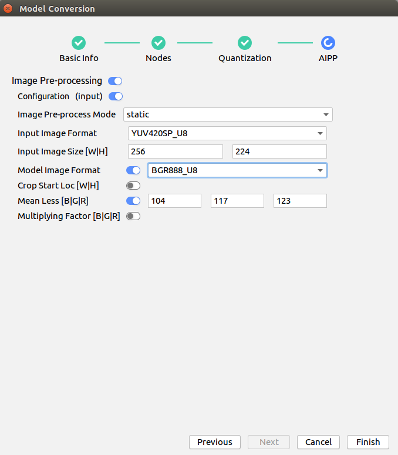

中文|[English](Readme_EN.md)

**该案例仅仅用于学习，打通流程，不对效果负责，不支持商用。**

# 车辆检测<a name="ZH-CN_TOPIC_0208834984"></a>

开发者将本Application部署至Atlas 200 DK上实现对本地mp4文件或者RTSP视频流进行解码，对视频帧中的车辆及其属性进行预测，生成结构化信息发送至Server端进行保存、展示的功能。

当前分支中的应用适配**1.32.0.0及以上**版本的[DDK&RunTime](https://ascend.huawei.com/resources)。

## 前提条件<a name="zh-cn_topic_0203223303_section137245294533"></a>

部署此Sample前，需要准备好以下环境：

-   已完成Mind Studio的安装。
-   已完成Atlas 200 DK开发者板与Mind Studio的连接，交叉编译器的安装，SD卡的制作及基本信息的配置等。

## 软件准备<a name="zh-cn_topic_0203223303_section8534138124114"></a>

运行此Sample前，需要按照此章节获取源码包，并进行相关的环境配置。

1.  <a name="zh-cn_topic_0203223303_li953280133816"></a>获取源码包。
    1.  下载压缩包方式获取。

        将[https://gitee.com/Atlas200DK/sample-videoanalysiscar/tree/1.3x.0.0/](https://gitee.com/Atlas200DK/sample-videoanalysiscar/tree/1.3x.0.0/)仓中的代码以Mind Studio安装用户下载至Mind Studio所在Ubuntu服务器的任意目录，例如代码存放路径为：$HOME/AscendProjects/sample-videoanalysiscar。

    2.  命令行使用git命令方式获取。

        在命令行中：$HOME/AscendProjects目录下执行以下命令下载代码。

        **git clone https://gitee.com/Atlas200DK/sample-videoanalysiscar.git --branch 1.3x.0.0**

2.  <a name="zh-cn_topic_0203223303_li8221184418455"></a>获取此应用中所需要的原始网络模型。

    参考[表1](#zh-cn_topic_0203223303_table117203103464)获取此应用中所用到的原始网络模型及其对应的权重文件，并将其存放到Mind Studio所在Ubuntu服务器的任意目录，这两个文件必须存放到同一个目录下。例如：$HOME/models/videoanalysiscar_。_

    **表 1**  车辆检测应用中使用的模型

    <a name="zh-cn_topic_0203223303_table117203103464"></a>
    <table><thead align="left"><tr id="zh-cn_topic_0203223303_row4859191074617"><th class="cellrowborder" valign="top" width="17.32173217321732%" id="mcps1.2.4.1.1"><p id="zh-cn_topic_0203223303_p18859111074613"><a name="zh-cn_topic_0203223303_p18859111074613"></a><a name="zh-cn_topic_0203223303_p18859111074613"></a>模型名称</p>
    </th>
    <th class="cellrowborder" valign="top" width="9.68096809680968%" id="mcps1.2.4.1.2"><p id="zh-cn_topic_0203223303_p17859171013469"><a name="zh-cn_topic_0203223303_p17859171013469"></a><a name="zh-cn_topic_0203223303_p17859171013469"></a>模型说明</p>
    </th>
    <th class="cellrowborder" valign="top" width="72.997299729973%" id="mcps1.2.4.1.3"><p id="zh-cn_topic_0203223303_p1385991094614"><a name="zh-cn_topic_0203223303_p1385991094614"></a><a name="zh-cn_topic_0203223303_p1385991094614"></a>模型下载路径</p>
    </th>
    </tr>
    </thead>
    <tbody><tr id="zh-cn_topic_0203223303_row1085921012469"><td class="cellrowborder" valign="top" width="17.32173217321732%" headers="mcps1.2.4.1.1 "><p id="zh-cn_topic_0203223303_p168591710184613"><a name="zh-cn_topic_0203223303_p168591710184613"></a><a name="zh-cn_topic_0203223303_p168591710184613"></a>car_color</p>
    </td>
    <td class="cellrowborder" valign="top" width="9.68096809680968%" headers="mcps1.2.4.1.2 "><p id="zh-cn_topic_0203223303_p118591410204619"><a name="zh-cn_topic_0203223303_p118591410204619"></a><a name="zh-cn_topic_0203223303_p118591410204619"></a>车辆颜色识别模型。</p>
    </td>
    <td class="cellrowborder" valign="top" width="72.997299729973%" headers="mcps1.2.4.1.3 "><p id="zh-cn_topic_0203223303_p11859310174613"><a name="zh-cn_topic_0203223303_p11859310174613"></a><a name="zh-cn_topic_0203223303_p11859310174613"></a>请参考<a href="https://gitee.com/HuaweiAscend/models/tree/master/computer_vision/classification/car_color" target="_blank" rel="noopener noreferrer">https://gitee.com/HuaweiAscend/models/tree/master/computer_vision/classification/car_color</a>目录中README.md下载原始网络模型文件及其对应的权重文件。</p>
    </td>
    </tr>
    <tr id="zh-cn_topic_0203223303_row78596105463"><td class="cellrowborder" valign="top" width="17.32173217321732%" headers="mcps1.2.4.1.1 "><p id="zh-cn_topic_0203223303_p118591910104615"><a name="zh-cn_topic_0203223303_p118591910104615"></a><a name="zh-cn_topic_0203223303_p118591910104615"></a>car_type</p>
    </td>
    <td class="cellrowborder" valign="top" width="9.68096809680968%" headers="mcps1.2.4.1.2 "><p id="zh-cn_topic_0203223303_p1685991044614"><a name="zh-cn_topic_0203223303_p1685991044614"></a><a name="zh-cn_topic_0203223303_p1685991044614"></a>车辆品牌识别模型。</p>
    <p id="zh-cn_topic_0203223303_p13859410184613"><a name="zh-cn_topic_0203223303_p13859410184613"></a><a name="zh-cn_topic_0203223303_p13859410184613"></a>基于Caffe的GoogleNet模型。</p>
    </td>
    <td class="cellrowborder" valign="top" width="72.997299729973%" headers="mcps1.2.4.1.3 "><p id="zh-cn_topic_0203223303_p1985915105461"><a name="zh-cn_topic_0203223303_p1985915105461"></a><a name="zh-cn_topic_0203223303_p1985915105461"></a>请参考<a href="https://gitee.com/HuaweiAscend/models/tree/master/computer_vision/classification/car_type" target="_blank" rel="noopener noreferrer">https://gitee.com/HuaweiAscend/models/tree/master/computer_vision/classification/car_type</a>目录中README.md下载原始网络模型文件及其对应的权重文件。</p>
    </td>
    </tr>
    <tr id="zh-cn_topic_0203223303_row1985913103461"><td class="cellrowborder" valign="top" width="17.32173217321732%" headers="mcps1.2.4.1.1 "><p id="zh-cn_topic_0203223303_p14859151016464"><a name="zh-cn_topic_0203223303_p14859151016464"></a><a name="zh-cn_topic_0203223303_p14859151016464"></a>car_plate_detection</p>
    </td>
    <td class="cellrowborder" valign="top" width="9.68096809680968%" headers="mcps1.2.4.1.2 "><p id="zh-cn_topic_0203223303_p108593100461"><a name="zh-cn_topic_0203223303_p108593100461"></a><a name="zh-cn_topic_0203223303_p108593100461"></a>车牌检测网络模型。</p>
    <p id="zh-cn_topic_0203223303_p1785921024614"><a name="zh-cn_topic_0203223303_p1785921024614"></a><a name="zh-cn_topic_0203223303_p1785921024614"></a>基于Caffe的Mobilenet-SSD模型。</p>
    </td>
    <td class="cellrowborder" valign="top" width="72.997299729973%" headers="mcps1.2.4.1.3 "><p id="zh-cn_topic_0203223303_p158596106460"><a name="zh-cn_topic_0203223303_p158596106460"></a><a name="zh-cn_topic_0203223303_p158596106460"></a>请参考<a href="https://gitee.com/HuaweiAscend/models/tree/master/computer_vision/object_detect/car_plate_detection" target="_blank" rel="noopener noreferrer">https://gitee.com/HuaweiAscend/models/tree/master/computer_vision/object_detect/car_plate_detection</a>目录中README.md下载原始网络模型文件及其对应的权重文件。</p>
    </td>
    </tr>
    <tr id="zh-cn_topic_0203223303_row08596101464"><td class="cellrowborder" valign="top" width="17.32173217321732%" headers="mcps1.2.4.1.1 "><p id="zh-cn_topic_0203223303_p178591510164619"><a name="zh-cn_topic_0203223303_p178591510164619"></a><a name="zh-cn_topic_0203223303_p178591510164619"></a>car_plate_recognition</p>
    </td>
    <td class="cellrowborder" valign="top" width="9.68096809680968%" headers="mcps1.2.4.1.2 "><p id="zh-cn_topic_0203223303_p1485911105469"><a name="zh-cn_topic_0203223303_p1485911105469"></a><a name="zh-cn_topic_0203223303_p1485911105469"></a>车牌号码识别网络模型。</p>
    <p id="zh-cn_topic_0203223303_p17859191018468"><a name="zh-cn_topic_0203223303_p17859191018468"></a><a name="zh-cn_topic_0203223303_p17859191018468"></a>基于Caffe的CNN模型。</p>
    </td>
    <td class="cellrowborder" valign="top" width="72.997299729973%" headers="mcps1.2.4.1.3 "><p id="zh-cn_topic_0203223303_p7859181094619"><a name="zh-cn_topic_0203223303_p7859181094619"></a><a name="zh-cn_topic_0203223303_p7859181094619"></a>请参考<a href="https://gitee.com/HuaweiAscend/models/tree/master/computer_vision/classification/car_plate_recognition" target="_blank" rel="noopener noreferrer">https://gitee.com/HuaweiAscend/models/tree/master/computer_vision/classification/car_plate_recognition</a>目录中README.md下载原始网络模型文件及其对应的权重文件。</p>
    </td>
    </tr>
    <tr id="zh-cn_topic_0203223303_row88591310124617"><td class="cellrowborder" valign="top" width="17.32173217321732%" headers="mcps1.2.4.1.1 "><p id="zh-cn_topic_0203223303_p685911013465"><a name="zh-cn_topic_0203223303_p685911013465"></a><a name="zh-cn_topic_0203223303_p685911013465"></a>vgg_ssd</p>
    </td>
    <td class="cellrowborder" valign="top" width="9.68096809680968%" headers="mcps1.2.4.1.2 "><p id="zh-cn_topic_0203223303_p1786011016461"><a name="zh-cn_topic_0203223303_p1786011016461"></a><a name="zh-cn_topic_0203223303_p1786011016461"></a>目标检测网络模型。</p>
    <p id="zh-cn_topic_0203223303_p086018109465"><a name="zh-cn_topic_0203223303_p086018109465"></a><a name="zh-cn_topic_0203223303_p086018109465"></a>基于Caffe的SSD512模型。</p>
    </td>
    <td class="cellrowborder" valign="top" width="72.997299729973%" headers="mcps1.2.4.1.3 "><p id="zh-cn_topic_0203223303_p1186071044613"><a name="zh-cn_topic_0203223303_p1186071044613"></a><a name="zh-cn_topic_0203223303_p1186071044613"></a>请参考<a href="https://gitee.com/HuaweiAscend/models/tree/master/computer_vision/object_detect/vgg_ssd" target="_blank" rel="noopener noreferrer">https://gitee.com/HuaweiAscend/models/tree/master/computer_vision/object_detect/vgg_ssd</a>目录中README.md下载原始网络模型文件及其对应的权重文件。</p>
    </td>
    </tr>
    </tbody>
    </table>

3.  以Mind Studio安装用户登录Mind Studio所在Ubuntu服务器，确定当前使用的DDK版本号并设置环境变量DDK\_HOME，tools\_version，LD\_LIBRARY\_PATH。
    1.  <a name="zh-cn_topic_0203223303_zh-cn_topic_0203223294_li61417158198"></a>查询当前使用的DDK版本号。

        可通过Mind Studio工具查询，也可以通过DDK软件包进行获取。

        -   使用Mind Studio工具查询。

            在Mind Studio工程界面依次选择“File \> Settings \> System Settings \> Ascend DDK“，弹出如[图 DDK版本号查询](#zh-cn_topic_0203223303_zh-cn_topic_0203223294_fig17553193319118)所示界面。

            **图 1**  DDK版本号查询<a name="zh-cn_topic_0203223303_zh-cn_topic_0203223294_fig17553193319118"></a>  
            

            其中显示的**DDK Version**就是当前使用的DDK版本号，如**1.32.0.B080**。

        -   通过DDK软件包进行查询。

            通过安装的DDK的包名获取DDK的版本号。

            DDK包的包名格式为：**Ascend\_DDK-\{software version\}-\{interface version\}-x86\_64.ubuntu16.04.tar.gz**

            其中**software version**就是DDK的软件版本号。

            例如：

            DDK包的包名为Ascend\_DDK-1.32.0.B080-1.1.1-x86\_64.ubuntu16.04.tar.gz，则此DDK的版本号为1.32.0.B080。

    2.  设置环境变量。

        **vim \~/.bashrc**

        执行如下命令在最后一行添加DDK\_HOME及LD\_LIBRARY\_PATH的环境变量。

        **export tools\_version=_1.32.X.X_**

        **export DDK\_HOME=$HOME/.mindstudio/huawei/ddk/_1.32.X.X_/ddk**

        **export LD\_LIBRARY\_PATH=$DDK\_HOME/lib/x86\_64-linux-gcc5.4**

        > **说明：**   
        >-   **_1.32.X.X_**是[a](#zh-cn_topic_0203223303_zh-cn_topic_0203223294_li61417158198)中查询到的DDK版本号，需要根据查询结果对应填写，如**1.32.0.B080**  
        >-   如果此环境变量已经添加，则此步骤可跳过。  

        输入:wq!保存退出。

        执行如下命令使环境变量生效。

        **source \~/.bashrc**

4.  将原始网络模型转换为适配昇腾AI处理器的模型，模型转换有Mind Studio工具转换和命令行转换两种方式。
    -   通过Mind Studio工具进行模型转换。
        1.  在Mind Studio操作界面的顶部菜单栏中选择**Tools \> Model Convert**，进入模型转换界面。
        2.  在弹出的**Model** **Conversion**操作界面中，进行模型转换配置。
            -   Model File选择[步骤2](#zh-cn_topic_0203223303_li8221184418455)中下载的模型文件，此时会自动匹配到权重文件并填写在Weight File中。
            -   Model Name填写为[表1](#zh-cn_topic_0203223303_table117203103464)对应的**模型名称**。
            -   car\_color模型转换时的非默认配置如下：
                -   car\_color\_inference一次处理10张图片，所以转换时需要将Nodes配置中的**N**修改为10。

                    **图 2**  car\_color模型转换时Nodes配置。<a name="zh-cn_topic_0203223303_fig14958101714361"></a>  
                    

                    

                -   AIPP配置中的**Input Image Size**分别修改为256、224。此处需要128\*16对齐。**Model Image Format**需要修改为BGR888\_U8。

                    

            -   CAR\_TYPE模型转换时非默认配置如下：

                AIPP配置中的**INPUT IMAGE SIZE**分别修改为256、224，此处需要128\*16对齐。**Model Image Format**需要修改为BGR888\_U8。

                **图 3**  car\_type模型转换时AIPP配置<a name="zh-cn_topic_0203223303_fig193425535216"></a>  
                

            -   car\_plate\_detection模型转换时非默认配置如下：

                AIPP配置中的**Input Image Size**分别修改为512、640，此处需要128\*16对齐。**Model Image Format**需要修改为BGR888\_U8。

                **图 4**  car\_plate\_detection模型转换时AIPP配置<a name="zh-cn_topic_0203223303_fig1175817321825"></a>  
                

                

            -   car\_plate\_recognition模型转换时非默认配置如下：

                AIPP配置中的**Input Image Size**分别修改为384、80，此处需要128\*16对齐。**Model Image Format**需要修改为BGR888\_U8。

                **图 5**  car\_plate\_recognition模型转换时AIPP配置<a name="zh-cn_topic_0203223303_fig10486111811264"></a>  
                

                

            -   vgg\_ssd模型转换时非默认配置如下：

                **Model Image Format**需要修改为BGR888\_U8。

                **图 6**  vgg\_ssd模型转换时AIPP配置<a name="zh-cn_topic_0203223303_fig17951565245"></a>  
                

                

        3.  单击**OK**开始转换模型。

            car\_plate\_detection、vgg\_ssd模型在转换的时候，会有报错，错误信息如下图所示。

            **图 7**  模型转换错误<a name="zh-cn_topic_0203223303_fig1842765585311"></a>  
            

            

            此时在DetectionOutput层的Suggestion中选择SSDDetectionOutput，并点击Retry。

            模型转换成功后，后缀为.om的离线模型存放地址为：$HOME/modelzoo/xxx/device。

            > **说明：**   
            >-   Mind Studio模型转换中每一步的具体意义和参数说明可以参考[Mind Studio用户手册](https://ascend.huawei.com/doc/mindstudio/)中的“模型转换“章节。  
            >-   XXX表示当前转换的模型名称，如car\_color.om存放地址为：$HOME/modelzoo/car\_color/device。  


    -   命令行模式下模型转换。
        1.  以Mind Studio安装用户进入存放原始模型的文件夹。

            **cd $HOME/models/videoanalysiscar**

        2.  调用omg工具执行以下命令进行模型转换。

            ```
            ${DDK_HOME}/uihost/bin/omg --output="./XXX" --model="./XXX.prototxt" --framework=0 --ddk_version=${tools_version} --weight="./XXX.caffemodel" --input_shape=`head -1 $HOME/AscendProjects/sample-videoanalysiscar/script/shape_XXX` --insert_op_conf=$HOME/AscendProjects/sample-videoanalysiscar/script/aipp_XXX.cfg --op_name_map=$HOME/AscendProjects/sample-videoanalysiscar/script/reassign_operators
            ```

            > **说明：**   
            >-   input\_shape、insert\_op\_conf、op\_name\_map所需要的文件都在源码所在路径下的“sample-videoanalysiscar/script”目录下，请根据您实际的源码所在路径配置这些文件路径。  
            >-   **XXX**为[表1](#zh-cn_topic_0203223303_table117203103464)中的模型名称，转换时请替换填入需要转换模型的模型名称。其中car\_plate\_recognition、car\_type、car\_color模型转换时不需要op\_name\_map参数，如果没有删除不需要的参数，转换模型时会有报错。  
            >-   每个参数的具体意义可参考[Atlas 200 DK用户手册](https://ascend.huawei.com/doc/atlas200dk/)中的“模型转换“章节。  


5.  将转换好的模型文件（.om文件）上传到[步骤1](#zh-cn_topic_0203223303_li953280133816)中源码所在路径的“**sample-videoanalysiscar/script**”目录下。

## 编译<a name="zh-cn_topic_0203223303_section1759513564117"></a>

1.  打开对应的工程。

    以Mind Studio安装用户在命令行中进入安装包解压后的“MindStudio-ubuntu/bin”目录，如：$HOME/MindStudio-ubuntu/bin。执行如下命令启动Mind Studio

    **./MindStudio.sh**

    启动成功后，打开**sample-videoanalysiscar**工程，如[图8](#zh-cn_topic_0203223303_fig721144422212)所示。

    **图 8**  打开sample-videoanalysisperson工程<a name="zh-cn_topic_0203223303_fig721144422212"></a>  
    

    

2.  在src/param\_configure.conf文件中配置相关工程信息。

    **图 9**  配置文件路径<a name="zh-cn_topic_0203223303_fig1557065718252"></a>  
    

    

    该配置文件默认配置内容如下：

    ```
    remote_host=192.168.1.2
    presenter_view_app_name=video
    video_path_of_host=/home/HwHiAiUser/car.mp4
    rtsp_video_stream=
    ```

    -   remote\_host：配置为Atlas 200 DK开发者板的IP地址。
    -   presenter\_view\_app\_name: 用户自定义的在PresenterServer界面展示的View Name，此View Name需要在Presenter Server展示界面唯一，只能为大小写字母、数字、“\_”的组合，位数3\~20。
    -   video\_path\_of\_host：配置为HOST侧的视频文件的绝对路径。
    -   rtsp\_video\_stream：配置为RTSP视频流的URL。

    视频文件配置示例如下：

    ```
    remote_host=192.168.1.2
    presenter_view_app_name=video
    video_path_of_host=/home/HwHiAiUser/car.mp4
    rtsp_video_stream=
    ```

    Rtsp视频流配置示例如下：

    ```
    remote_host=192.168.1.2
    presenter_view_app_name=video
    video_path_of_host=
    rtsp_video_stream=rtsp://192.168.2.37:554/cam/realmonitor?channel=1&subtype=0
    ```

    > **说明：**   
    >-   参数remote\_host和presenter\_view\_app\_name必须全部填写，否则无法通过build。  
    >-   注意所填参数不用使用“”。  
    >-   参数video\_path\_of\_host和rtsp\_video\_stream必须至少填写一项。  
    >-   当前RTSP视频流只支持rtsp://ip:port/path格式，如果需要使用其它格式的url，需要把video\_decode.cpp中的IsValidRtsp函数去除，或者直接返回true，跳过正则表达式匹配。  
    >-   本样例中提供的RTSP流地址不可以直接使用。如果需要使用RTSP，请在本地使用live555或其它方式制作RTSP视频流，并且可以在VLC中播放。然后将本地制作好的RTSP视频流的URL填入配置文件的相应参数中，即可运行。  
    >-   当前已经按照配置示例配置默认值，请按照配置情况自行修改。  

3.  执行deploy脚本， 进行配置参数调整及第三方库下载编译 打开Mind Studio工具的Terminal，此时默认在代码主目录下，执行如下命令在后台指执行deploy脚本，进行环境部署。如[图 执行deploy脚本](#zh-cn_topic_0203223303_fig4889032182315)所示。

    **图 10**  执行deploy脚本<a name="zh-cn_topic_0203223303_fig4889032182315"></a>  
    

    > **说明：**   
    >-   首次deploy时，没有部署第三方库时会自动下载并编译，耗时可能比较久，请耐心等待。后续再重新编译时，不会重复下载编译，部署如上图所示。  
    >-   deploy时，需要选择与开发板通信的主机侧ip，一般为虚拟网卡配置的ip。如果此ip和开发板ip属于同网段，则会自动选择并部署。如果非同网段，则需要手动输入与开发板通信的主机侧ip才能完成deploy。  

4.  开始编译，打开Mind Studio工具，在工具栏中点击**Build \> Build \> Build-Configuration**。如[图11](#zh-cn_topic_0203223303_fig13819202814301)所示，会在目录下生成build和run文件夹。

    **图 11**  编译操作及生成文件<a name="zh-cn_topic_0203223303_fig13819202814301"></a>  
    

    

    > **须知：**   
    >首次编译工程时，**Build \> Build**为灰色不可点击状态。需要点击**Build \> Edit Build Configuration**，配置编译参数后再进行编译。  

5.  启动Presenter Server。

    打开Mindstudio工具的Terminal，在应用代码存放路径下，执行如下命令在后台启动Video Analysiscar应用的Presenter Server主程序。如[图 启动PresenterServer](#zh-cn_topic_0203223303_fig102142024389)所示。

    **bash run\_present\_server.sh**

    **图 12**  启动PresenterServer<a name="zh-cn_topic_0203223303_fig102142024389"></a>  
    

    

    -   当提示“Please choose one to show the presenter in browser\(default: 127.0.0.1\):“时，请输入在浏览器中访问Presenter Server服务所使用的IP地址（一般为访问Mind Studio的IP地址）。

        如[图13](#zh-cn_topic_0203223303_fig73590910118)所示，请在“Current environment valid ip list“中选择通过浏览器访问Presenter Server服务使用的IP地址，并输入存储视频解析数据的路径。

        **图 13**  工程部署示意图<a name="zh-cn_topic_0203223303_fig73590910118"></a>  
        

        

    -   当提示“Please input a absolute path to storage video analysis data:“时，请输入Mind Studio中的绝对路径用于存储视频解析数据，此路径Mind Studio用户需要有读写权限，若此路径不存在，脚本会自动创建。

    如[图14](#zh-cn_topic_0203223303_fig19953175965417)所示，表示presenter\_server的服务启动成功。

    **图 14**  Presenter Server进程启动<a name="zh-cn_topic_0203223303_fig19953175965417"></a>  
    

    

    使用上图提示的URL登录Presenter Server，IP地址为[图13](#zh-cn_topic_0203223303_fig73590910118)中输入的IP地址，端口号默为7005，如下图所示，表示Presenter Server启动成功。

    **图 15**  主页显示<a name="zh-cn_topic_0203223303_fig129539592546"></a>  
    

    Presenter Server、Mind Studio与Atlas 200 DK之间通信使用的IP地址示例如下图所示：

    **图 16**  IP地址示例<a name="zh-cn_topic_0203223303_fig195318596543"></a>  
    

    -   Atlas 200 DK开发者板使用的IP地址为192.168.1.2（USB方式连接）。
    -   Presenter Server与Atlas 200 DK通信的IP地址为UI Host服务器中与Atlas 200 DK在同一网段的IP地址，例如：192.168.1.223。
    -   通过浏览器访问Presenter Server的IP地址本示例为：10.10.0.1，由于Presenter Server与Mind Studio部署在同一服务器，此IP地址也为通过浏览器访问Mind Studio的IP。

6.  车辆检测应用支持解析本地视频和RTSP视频流。
    -   如果需要解析本地视频，需要将视频文件传到Host侧。

        例如将视频文件car.mp4上传到Host侧的“/home/HwHiAiUser/“目录下。

        > **说明：**   
        >支持H264与H265格式的MP4文件，如果MP4文件需要剪辑，建议使用开源工具ffmpeg，使用其他工具剪辑的视频文件ffmpeg工具可能不支持解析。  

    -   如果仅解析RTSP视频流，本步骤可跳过。


## 运行<a name="zh-cn_topic_0203223303_section6245151616426"></a>

1.  运行车辆检测应用程序

    在Mind Studio工具的工具栏中找到Run按钮，点击**Run \> Run 'sample-videoanalysiscar'**，如[图17](#zh-cn_topic_0203223303_fig12953163061713)所示，可执行程序已经在开发板执行。

    **图 17**  程序运行示意图<a name="zh-cn_topic_0203223303_fig12953163061713"></a>  
    

    

2.  使用启动Presenter Server服务时提示的URL登录 Presenter Server 网站。

    > **说明：**   
    >车辆检测应用的Presenter Server最多支持2个  _presenter\_view\_app\_name_  同时显示。  

    页面左侧树结构列出了视频所属app name以及通道名，中间列出了抽取的视频帧大图以及检测出的目标小图，点击下方小图后会在右侧列出详细的推理结果、评分。

    本应用支持车辆属性检测，包括车辆品牌、车辆颜色的识别和车牌号码识别。

    > **说明：**   
    >车牌号码识别的网络模型，是通过程序自动生成的车牌作为训练集图片训练的，不是使用真实车牌图片训练的。所以该模型在识别真实车牌号码时准确度比较低，如果需要较高的准确度的模型，请自己搜集真实车牌图片作为训练集并训练。  


## 后续处理<a name="zh-cn_topic_0203223303_section1092612277429"></a>

-   **停止车辆检测应用**

    视频程序分析完之后会自动退出，如[图18](#zh-cn_topic_0203223303_fig464152917203)所示。

    **图 18**  Video Analysiscar应用程序运行结束<a name="zh-cn_topic_0203223303_fig464152917203"></a>  
    

    

-   **停止Presenter Server服务**

    Presenter Server服务启动后会一直处于运行状态，若想停止车辆检测应用对应的Presenter Server服务，可执行如下操作。

    以Mind Studio安装用户在Mind Studio所在服务器的命令行中执行如下命令查看车辆检测应用对应的Presenter Server服务的进程。

    **ps -ef | grep presenter | grep video\_analysis\_car**

    ```
    ascend@ascend-HP-ProDesk-600-G4-PCI-MT:~/sample-videoanalysiscar$ ps -ef | grep presenter | grep video_analysis_car
    ascend 3655 20313 0 15:10 pts/24?? 00:00:00 python3 presenterserver/presenter_server.py --app video_analysis_car
    ```

    如上所示  _3655_  即为车辆检测应用对应的Presenter Server服务的进程ID。

    若想停止此服务，执行如下命令：

    **kill -9** _3655_

-   **重启车辆检测应用时注意点**

    重新启动车辆检测应用时请确保以下条件满足任意一个，否则会报错:

    1.  请确保视频解析数据存储路径中内容已经清空。

        例如：视频解析数据存储路径为：$HOME/videocar\_storage/video，其中：$HOME/videocar\_storage是启动Presenter Server时配置的“Please input a absolute path to storage video analysis data”的值，video为**param\_configure.conf**配置文件中参数**presenter\_view\_app\_name**的值。

        满足此条件情况下，无需重启Presenter Server，直接重新执行**Run \> Run 'sample-videoanalysiscar'**运行应用程序即可。

    2.  视频解析数据存储路径中如果已有数据且不想删除，可以修改**param\_configure.conf**配置文件中**presenter\_view\_app\_name**参数的值，然后在Mind Studio界面中重新执行**Build \> Rebuild**，再执行**Run \> Run 'sample-videoanalysiscar'**即可。

        **param\_configure.conf**配置文件中参数**presenter\_view\_app\_name**的值如下所示。

        

        满足此条件情况下，无需重启Presenter Server。

    3.  若重新启动Presenter Server，再运行车辆检测应用，在启动Presenter Server时请修改存储视频解析的数据的路径（不与之前存储路径重复）。


