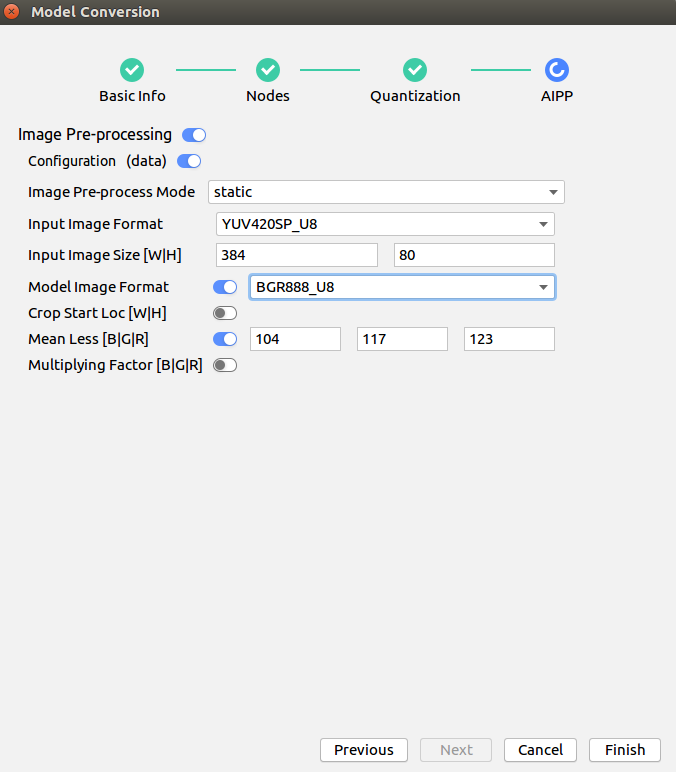
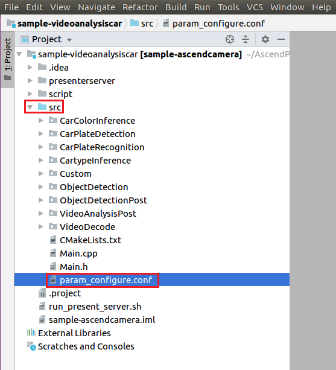
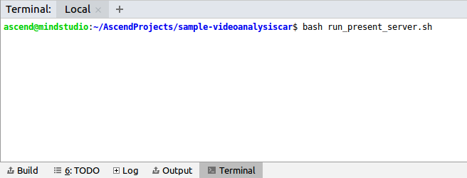
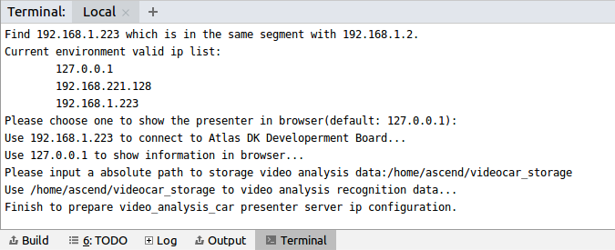
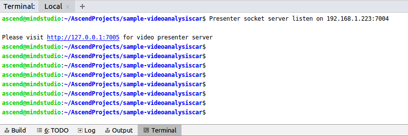
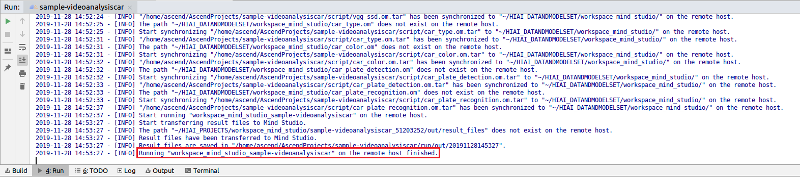

English|[中文](Readme.md)

**This case is only used for learning. It is not responsible for the effect and does not support commercial use.**

# Vehicle Detection<a name="EN-US_TOPIC_0232613735"></a>

You can deploy this application on the Atlas 200 DK to decode the local MP4 file or RTSP video streams, detect vehicles in video frames, predict their attributes, generate structured information, and send the structured information to the server for storage and display.

The applications in the current version branch adapt to  [DDK&RunTime](https://ascend.huawei.com/resources) **1.32.0.0 and later**.

## Prerequisites<a name="en-us_topic_0203223303_section137245294533"></a>

Before deploying this sample, ensure that:

-   Mind Studio  has been installed.
-   The Atlas 200 DK developer board has been connected to  Mind Studio, the cross compiler has been installed, the SD card has been prepared, and basic information has been configured.

## Software Preparation<a name="en-us_topic_0203223303_section8534138124114"></a>

Before running the sample, obtain the source code package and configure the environment as follows:

1.  <a name="en-us_topic_0203223303_li953280133816"></a>Obtain the source code package.
    1.  By downloading the package

        Download all the code in the repository at  [https://gitee.com/Atlas200DK/sample-videoanalysiscar/tree/1.3x.0.0/](https://gitee.com/Atlas200DK/sample-videoanalysiscar/tree/1.3x.0.0/)  to any directory on Ubuntu Server where Mind Studio is located as the Mind Studio installation user, for example,  _$HOME/AscendProjects/sample-videoanalysiscar_.

    2.  By running the  **git**  command

        Run the following command in the  **$HOME/AscendProjects**  directory to download code:

        **git clone https://gitee.com/Atlas200DK/sample-videoanalysiscar.git --branch 1.3x.0.0**

2.  <a name="en-us_topic_0203223303_li8221184418455"></a>Obtain the source network model required by the application.

    Obtain the source network model and its weight file used in the application by referring to  [Table 1](#en-us_topic_0203223303_table117203103464)  and save them to the same directory on Ubuntu Server where  Mind Studio  is located, for example,  **$HOME/models/videoanalysiscar**.

    **Table  1**  Models used in the vehicle detection application

    <a name="en-us_topic_0203223303_table117203103464"></a>
    <table><thead align="left"><tr id="en-us_topic_0203223303_row4859191074617"><th class="cellrowborder" valign="top" width="17.171717171717173%" id="mcps1.2.4.1.1"><p id="en-us_topic_0203223303_p18859111074613"><a name="en-us_topic_0203223303_p18859111074613"></a><a name="en-us_topic_0203223303_p18859111074613"></a>Model Name</p>
    </th>
    <th class="cellrowborder" valign="top" width="21.21212121212121%" id="mcps1.2.4.1.2"><p id="en-us_topic_0203223303_p17859171013469"><a name="en-us_topic_0203223303_p17859171013469"></a><a name="en-us_topic_0203223303_p17859171013469"></a>Description</p>
    </th>
    <th class="cellrowborder" valign="top" width="61.61616161616161%" id="mcps1.2.4.1.3"><p id="en-us_topic_0203223303_p1385991094614"><a name="en-us_topic_0203223303_p1385991094614"></a><a name="en-us_topic_0203223303_p1385991094614"></a>Download Path</p>
    </th>
    </tr>
    </thead>
    <tbody><tr id="en-us_topic_0203223303_row1085921012469"><td class="cellrowborder" valign="top" width="17.171717171717173%" headers="mcps1.2.4.1.1 "><p id="en-us_topic_0203223303_p168591710184613"><a name="en-us_topic_0203223303_p168591710184613"></a><a name="en-us_topic_0203223303_p168591710184613"></a>car_color</p>
    </td>
    <td class="cellrowborder" valign="top" width="21.21212121212121%" headers="mcps1.2.4.1.2 "><p id="en-us_topic_0203223303_p118591410204619"><a name="en-us_topic_0203223303_p118591410204619"></a><a name="en-us_topic_0203223303_p118591410204619"></a>Network model for identifying the vehicle color.</p>
    </td>
    <td class="cellrowborder" valign="top" width="61.61616161616161%" headers="mcps1.2.4.1.3 "><p id="en-us_topic_0203223303_p11859310174613"><a name="en-us_topic_0203223303_p11859310174613"></a><a name="en-us_topic_0203223303_p11859310174613"></a>Download the source network model file and its weight file by referring to<strong id="en-us_topic_0203223303_b161561310195113"><a name="en-us_topic_0203223303_b161561310195113"></a><a name="en-us_topic_0203223303_b161561310195113"></a> README.md</strong> at <a href="https://gitee.com/HuaweiAscend/models/tree/master/computer_vision/classification/car_color" target="_blank" rel="noopener noreferrer">https://gitee.com/HuaweiAscend/models/tree/master/computer_vision/classification/car_color</a>.</p>
    </td>
    </tr>
    <tr id="en-us_topic_0203223303_row78596105463"><td class="cellrowborder" valign="top" width="17.171717171717173%" headers="mcps1.2.4.1.1 "><p id="en-us_topic_0203223303_p118591910104615"><a name="en-us_topic_0203223303_p118591910104615"></a><a name="en-us_topic_0203223303_p118591910104615"></a>car_type</p>
    </td>
    <td class="cellrowborder" valign="top" width="21.21212121212121%" headers="mcps1.2.4.1.2 "><p id="en-us_topic_0203223303_p1685991044614"><a name="en-us_topic_0203223303_p1685991044614"></a><a name="en-us_topic_0203223303_p1685991044614"></a>Network model for identifying the vehicle brand.</p>
    <p id="en-us_topic_0203223303_p13859410184613"><a name="en-us_topic_0203223303_p13859410184613"></a><a name="en-us_topic_0203223303_p13859410184613"></a>It is a GoogLeNet model based on Caffe.</p>
    </td>
    <td class="cellrowborder" valign="top" width="61.61616161616161%" headers="mcps1.2.4.1.3 "><p id="en-us_topic_0203223303_p1985915105461"><a name="en-us_topic_0203223303_p1985915105461"></a><a name="en-us_topic_0203223303_p1985915105461"></a>Download the source network model file and its weight file by referring to<strong id="en-us_topic_0203223303_b118202427542"><a name="en-us_topic_0203223303_b118202427542"></a><a name="en-us_topic_0203223303_b118202427542"></a> README.md</strong> at <a href="https://gitee.com/HuaweiAscend/models/tree/master/computer_vision/classification/car_type" target="_blank" rel="noopener noreferrer">https://gitee.com/HuaweiAscend/models/tree/master/computer_vision/classification/car_type</a>.</p>
    </td>
    </tr>
    <tr id="en-us_topic_0203223303_row1985913103461"><td class="cellrowborder" valign="top" width="17.171717171717173%" headers="mcps1.2.4.1.1 "><p id="en-us_topic_0203223303_p14859151016464"><a name="en-us_topic_0203223303_p14859151016464"></a><a name="en-us_topic_0203223303_p14859151016464"></a>car_plate_detection</p>
    </td>
    <td class="cellrowborder" valign="top" width="21.21212121212121%" headers="mcps1.2.4.1.2 "><p id="en-us_topic_0203223303_p108593100461"><a name="en-us_topic_0203223303_p108593100461"></a><a name="en-us_topic_0203223303_p108593100461"></a>Network model for identifying the license plate number.</p>
    <p id="en-us_topic_0203223303_p1785921024614"><a name="en-us_topic_0203223303_p1785921024614"></a><a name="en-us_topic_0203223303_p1785921024614"></a>It is a MobileNet-SSD model based on Caffe.</p>
    </td>
    <td class="cellrowborder" valign="top" width="61.61616161616161%" headers="mcps1.2.4.1.3 "><p id="en-us_topic_0203223303_p158596106460"><a name="en-us_topic_0203223303_p158596106460"></a><a name="en-us_topic_0203223303_p158596106460"></a>Download the source network model file and its weight file by referring to<strong id="en-us_topic_0203223303_b1818472518513"><a name="en-us_topic_0203223303_b1818472518513"></a><a name="en-us_topic_0203223303_b1818472518513"></a> README.md</strong> at <a href="https://gitee.com/HuaweiAscend/models/tree/master/computer_vision/object_detect/car_plate_detection" target="_blank" rel="noopener noreferrer">https://gitee.com/HuaweiAscend/models/tree/master/computer_vision/object_detect/car_plate_detection</a>.</p>
    </td>
    </tr>
    <tr id="en-us_topic_0203223303_row08596101464"><td class="cellrowborder" valign="top" width="17.171717171717173%" headers="mcps1.2.4.1.1 "><p id="en-us_topic_0203223303_p178591510164619"><a name="en-us_topic_0203223303_p178591510164619"></a><a name="en-us_topic_0203223303_p178591510164619"></a>car_plate_recognition</p>
    </td>
    <td class="cellrowborder" valign="top" width="21.21212121212121%" headers="mcps1.2.4.1.2 "><p id="en-us_topic_0203223303_p1485911105469"><a name="en-us_topic_0203223303_p1485911105469"></a><a name="en-us_topic_0203223303_p1485911105469"></a>Network model for identifying the license plate number.</p>
    <p id="en-us_topic_0203223303_p17859191018468"><a name="en-us_topic_0203223303_p17859191018468"></a><a name="en-us_topic_0203223303_p17859191018468"></a>It is a CNN model based on Caffe.</p>
    </td>
    <td class="cellrowborder" valign="top" width="61.61616161616161%" headers="mcps1.2.4.1.3 "><p id="en-us_topic_0203223303_p7859181094619"><a name="en-us_topic_0203223303_p7859181094619"></a><a name="en-us_topic_0203223303_p7859181094619"></a>Download the source network model file and its weight file by referring to<strong id="en-us_topic_0203223303_b73161446551"><a name="en-us_topic_0203223303_b73161446551"></a><a name="en-us_topic_0203223303_b73161446551"></a> README.md</strong> at <a href="https://gitee.com/HuaweiAscend/models/tree/master/computer_vision/classification/car_plate_recognition" target="_blank" rel="noopener noreferrer">https://gitee.com/HuaweiAscend/models/tree/master/computer_vision/classification/car_plate_recognition</a>.</p>
    </td>
    </tr>
    <tr id="en-us_topic_0203223303_row88591310124617"><td class="cellrowborder" valign="top" width="17.171717171717173%" headers="mcps1.2.4.1.1 "><p id="en-us_topic_0203223303_p685911013465"><a name="en-us_topic_0203223303_p685911013465"></a><a name="en-us_topic_0203223303_p685911013465"></a>vgg_ssd</p>
    </td>
    <td class="cellrowborder" valign="top" width="21.21212121212121%" headers="mcps1.2.4.1.2 "><p id="en-us_topic_0203223303_p1786011016461"><a name="en-us_topic_0203223303_p1786011016461"></a><a name="en-us_topic_0203223303_p1786011016461"></a>Network model for object detection.</p>
    <p id="en-us_topic_0203223303_p086018109465"><a name="en-us_topic_0203223303_p086018109465"></a><a name="en-us_topic_0203223303_p086018109465"></a>It is an SSD512 model based on Caffe.</p>
    </td>
    <td class="cellrowborder" valign="top" width="61.61616161616161%" headers="mcps1.2.4.1.3 "><p id="en-us_topic_0203223303_p1186071044613"><a name="en-us_topic_0203223303_p1186071044613"></a><a name="en-us_topic_0203223303_p1186071044613"></a>Download the source network model file and its weight file by referring to<strong id="en-us_topic_0203223303_b469184117518"><a name="en-us_topic_0203223303_b469184117518"></a><a name="en-us_topic_0203223303_b469184117518"></a> README.md</strong> at <a href="https://gitee.com/HuaweiAscend/models/tree/master/computer_vision/object_detect/vgg_ssd" target="_blank" rel="noopener noreferrer">https://gitee.com/HuaweiAscend/models/tree/master/computer_vision/object_detect/vgg_ssd</a>.</p>
    </td>
    </tr>
    </tbody>
    </table>

3.  Log in to Ubuntu Server where Mind Studio is located as the Mind Studio installation user, confirm the current DDK version, and set the environment variables  **DDK\_HOME**,  **tools\_version**, and  **LD\_LIBRARY\_PATH**.
    1.  <a name="en-us_topic_0203223303_en-us_topic_0203223294_li61417158198"></a>Query the current DDK version.

        A DDK version can be queried by using either Mind Studio or the DDK software package.

        -   Using Mind Studio

            On the project page of Mind Studio, choose  **File \> Settings \> System Settings \> Ascend DDK**  to query the DDK version.

            **Figure  1**  Querying the DDK version<a name="en-us_topic_0203223303_en-us_topic_0203223294_fig17553193319118"></a>  
            

            The displayed  **DDK Version**  is the current DDK version, for example,  **1.32.0.B080**.

        -   Using the DDK software package

            Obtain the DDK version based on the DDK package name.

            DDK package name format:  **Ascend\_DDK-\{software version\}-\{interface version\}-x86\_64.ubuntu16.04.tar.gz**

            _Software version_  indicates the DDK software version.

            For example:

            If the DDK package name is  **Ascend\_DDK-1.32.0.B080-1.1.1-x86\_64.ubuntu16.04.tar.gz**, the DDK version is  **1.32.0.B080**.

    2.  Set environment variables.

        **vim \~/.bashrc**

        Run the following commands to add the environment variables  **DDK\_HOME**  and  **LD\_LIBRARY\_PATH**  to the last line:

        **export tools\_version=_1.32.X.X_**

        **export DDK\_HOME=$HOME/.mindstudio/huawei/ddk/_1.32.X.X_/ddk**

        **export LD\_LIBRARY\_PATH=$DDK\_HOME/lib/x86\_64-linux-gcc5.4**

        > **NOTE:**   
        >-   **_1.32.X.X_**  indicates the DDK version queried in  [a](#en-us_topic_0203223303_en-us_topic_0203223294_li61417158198). Set this parameter based on the query result, for example,  **1.32.0.B080**.  
        >-   If the environment variables have been added, skip this step.  

        Type  **:wq!**  to save settings and exit.

        Run the following command for the environment variable to take effect:

        **source \~/.bashrc**

4.  Convert the source network model to a model supported by the Ascend AI processor. A model can be converted either using Mind Studio or in CLI mode.
    -   Convert a model using Mind Studio.
        1.  Choose  **Tools \> Model Convert**  from the main menu of Mind Studio.
        2.  On the  **Model Conversion**  page that is displayed, configure model conversion.
            -   Select the model file downloaded in  [Step 2](#en-us_topic_0203223303_li8221184418455)  for  **Model File**. The weight file is automatically matched and filled in  **Weight File**.
            -   Set  **Model Name**  to the model name in  [Table 1](#en-us_topic_0203223303_table117203103464).
            -   Set the following parameters for car\_color model conversion:
                -   The car\_color\_inference model processes 10 images at a time. Therefore, you need to change  **N**  in the  **Nodes**  configuration to  **10**  during conversion.

                    **Figure  2**  Nodes configuration for car\_color model conversion<a name="en-us_topic_0203223303_fig14958101714361"></a>  
                    

                    

                -   In the  **AIPP**  configuration, change the values of  **Input Image Size**  to  **256**  and  **224**  respectively. The values must be 128 x 16 aligned. Select  **BGR888\_U8**  for  **Model Image Format**.

                    

            -   Set the following parameters for car\_type model conversion:

                In the  **AIPP**  configuration, change the values of  **INPUT IMAGE SIZE**  to  **256**  and  **224**  respectively. The values must be 128 x 16 aligned. Select  **BGR888\_U8**  for  **Model Image Format**.

                **Figure  3**  AIPP configuration for car\_type model conversion<a name="en-us_topic_0203223303_fig193425535216"></a>  
                

            -   Set the following parameters for car\_plate\_detection model conversion:

                In the  **AIPP**  configuration, change the values of  **Input Image Size**  to  **512**  and  **640**  respectively. The values must be 128 x 16 aligned. Select  **BGR888\_U8**  for  **Model Image Format**.

                **Figure  4**  AIPP configuration for car\_plate\_detection model conversion<a name="en-us_topic_0203223303_fig1175817321825"></a>  
                

                

            -   Set the following parameters for car\_plate\_recognition model conversion:

                In the  **AIPP**  configuration, change the values of  **Input Image Size**  to  **384**  and  **80**  respectively. The values must be 128 x 16 aligned. Select  **BGR888\_U8**  for  **Model Image Format**.

                **Figure  5**  AIPP configuration for car\_plate\_detection model conversion<a name="en-us_topic_0203223303_fig10486111811264"></a>  
                

                

            -   Set the following parameters for vgg\_ssd model conversion:

                Select  **BGR888\_U8**  for  **Model Image Format**.

                **Figure  6**  AIPP configuration for vgg\_ssd model conversion<a name="en-us_topic_0203223303_fig17951565245"></a>  
                

                

        3.  Click  **OK**  to start model conversion.

            During the conversion of the  **car\_plate\_detection**  and** vgg\_ssd**  models, the following error will be reported.

            **Figure  7**  Model conversion error<a name="en-us_topic_0203223303_fig1842765585311"></a>  
            

            

            Select  **SSDDetectionOutput**  from the  **Suggestion**  drop-down list box at the  **DetectionOutput**  layer and click  **Retry**.

            After successful conversion, an .om offline model is generated in the  **$HOME/modelzoo/xxx/device**  directory.

            > **NOTE:**   
            >-   For details about the descriptions of each step and parameters in model conversion, see "Model Conversion" in the  [Mind Studio User Guide](https://ascend.huawei.com/doc/mindstudio/).  
            >-   **XXX**  indicates the name of the model to be converted. For example,  **car\_color.om**  is stored in  **$HOME/modelzoo/car\_color/device**.  


    -   Convert a model in CLI mode.
        1.  Go to the folder for storing the original model as the Mind Studio installation user.

            **cd $HOME/models/videoanalysiscar**

        2.  Run the following command to convert the model using OMG:

            ```
            ${DDK_HOME}/uihost/bin/omg --output="./XXX" --model="./XXX.prototxt" --framework=0 --ddk_version=${tools_version} --weight="./XXX.caffemodel" --input_shape=`head -1 $HOME/AscendProjects/sample-videoanalysiscar/script/shape_XXX` --insert_op_conf=$HOME/AscendProjects/sample-videoanalysiscar/script/aipp_XXX.cfg --op_name_map=$HOME/AscendProjects/sample-videoanalysiscar/script/reassign_operators
            ```

            > **NOTE:**   
            >-   The files required by  **input\_shape**,  **insert\_op\_conf**, and  **op\_name\_map**  are stored in the  **sample-videoanalysiscar/script**  directory under the source code path. Configure the file paths based on the actual source code path.  
            >-   **XXX**  indicates the name of the model used in  [Table 1](#en-us_topic_0203223303_table117203103464). Replace it with the name of the model to be converted. The  **op\_name\_map**  parameter is not required during the conversion of the  **car\_plate\_recognition**,  **car\_type**, and  **car\_color**  models. If unnecessary parameters are not deleted, an error is reported during model conversion.  
            >-   For details about parameter descriptions, see "Model Conversion" in the  [Atlas 200 DK User Guide](https://ascend.huawei.com/doc/atlas200dk/).  


5.  Upload the converted .om model file to the  **sample-videoanalysiscar/script**  directory in the source code path in  [Step 1](#en-us_topic_0203223303_li953280133816).

## Building a Project<a name="en-us_topic_0203223303_section1759513564117"></a>

1.  Open the project.

    Go to the directory that stores the decompressed installation package as the Mind Studio installation user in CLI mode, for example,  **$HOME/MindStudio-ubuntu/bin**. Run the following command to start Mind Studio:

    **./MindStudio.sh**

    After the startup is successful, open the  **sample-videoanalysiscar**  project, as shown in  [Figure 8](#en-us_topic_0203223303_fig721144422212).

    **Figure  8**  Opening the sample-videoanalysisperson project<a name="en-us_topic_0203223303_fig721144422212"></a>  
    

    

2.  Configure project information in the  **src/param\_configure.conf**  file.

    **Figure  9**  Configuration file path<a name="en-us_topic_0203223303_fig1557065718252"></a>  
    

    

    The default configurations of the configuration file are as follows:

    ```
    remote_host=192.168.1.2
    presenter_view_app_name=video
    video_path_of_host=/home/HwHiAiUser/car.mp4
    rtsp_video_stream=
    ```

    -   **remote\_host**: IP address of the Atlas 200 DK developer board
    -   **presenter\_view\_app\_name**: value of  **View Name**  on the  **Presenter Server**  page, which must be unique. The value consists of 3 to 20 characters and supports only uppercase letters, lowercase letters, digits, and underscores \(\_\).
    -   **video\_path\_of\_host**: absolute path of a video file on the host side
    -   **rtsp\_video\_stream**: URL of RTSP video streams

    Sample of video file configuration:

    ```
    remote_host=192.168.1.2
    presenter_view_app_name=video
    video_path_of_host=/home/HwHiAiUser/car.mp4
    rtsp_video_stream=
    ```

    Sample of RTSP video stream configuration:

    ```
    remote_host=192.168.1.2
    presenter_view_app_name=video
    video_path_of_host=
    rtsp_video_stream=rtsp://192.168.2.37:554/cam/realmonitor?channel=1&subtype=0
    ```

    > **NOTE:**   
    >-   **remote\_host**  and  **presenter\_view\_app\_name**  must be set. Otherwise, the build fails.  
    >-   Do not use double quotation marks \(""\) during parameter settings.  
    >-   Either  **video\_path\_of\_host**  or  **rtsp\_video\_stream**  must be set.  
    >-   Currently, RTSP video streams support only the  **rtsp://ip:port/path**  format. To use URLs in other formats, you need to delete the** IsValidRtsp**  function from the  **video\_decode.cpp**  file or configure the  **IsValidRtsp**  function to directly return  **true**  to skip regular expression matching.  
    >-   The RTSP stream URL provided in this sample cannot be directly used. If RTSP streams are required, create RTSP streams locally either using LIVE555 or other methods, which must support playback in the VLC. Type the URL of the RTSP video streams in the configuration file.  
    >-   Modify the default configurations as required.  

3.  Run the  **deploy.sh**  script to adjust configuration parameters and download and compile the third-party library. Open the  **Terminal**  window of Mind Studio. By default, the home directory of the code is used. Run the  **deploy.sh**  script in the background to deploy the environment, as shown in  [Figure 10](#en-us_topic_0203223303_fig4889032182315).

    **Figure  10**  Running the deploy.sh script<a name="en-us_topic_0203223303_fig4889032182315"></a>  
    

    > **NOTE:**   
    >-   During the first deployment, if no third-party library is used, the system automatically downloads and builds the third-party library, which may take a long time. The third-party library can be directly used for the subsequent build.  
    >-   During deployment, select the IP address of the host that communicates with the developer board. Generally, the IP address is that configured for the virtual NIC. If the IP address is in the same network segment as the IP address of the developer board, it is automatically selected for deployment. If they are not in the same network segment, you need to manually type the IP address of the host that communicates with the developer board to complete the deployment.  

4.  Start building. Open Mind Studio and choose  **Build \> Build \> Build-Configuration**  from the main menu. The  **build**  and  **run**  folders are generated in the directory, as shown in  [Figure 11](#en-us_topic_0203223303_fig13819202814301).

    **Figure  11**  Build and files generated<a name="en-us_topic_0203223303_fig13819202814301"></a>  
    

    

    > **NOTICE:**   
    >When you build a project for the first time,  **Build \> Build**  is unavailable. You need to choose  **Build \> Edit Build Configuration**  to set parameters before the build.  

5.  Start Presenter Server.

    Open the  **Terminal**  window of Mind Studio. Under the code path, run the following command to start the Presenter Server program of the Video Analysiscar application on the server, as shown in  [Figure 12](#en-us_topic_0203223303_fig102142024389).

    **bash run\_present\_server.sh**

    **Figure  12**  Starting Presenter Server<a name="en-us_topic_0203223303_fig102142024389"></a>  
    

    

    -   When the message  **Please choose one to show the presenter in browser\(default: 127.0.0.1\):**  is displayed, type the IP address \(usually IP address for accessing Mind Studio\) used for accessing the Presenter Server service in the browser.

        Select the IP address used by the browser to access the Presenter Server service in  **Current environment valid ip list**  and type the path for storing video analysis data, as shown in  [Figure 13](#en-us_topic_0203223303_fig73590910118).

        **Figure  13**  Project deployment<a name="en-us_topic_0203223303_fig73590910118"></a>  
        

        

    -   When the message  **Please input an absolute path to storage video analysis data:**  is displayed, enter the absolute path for storing video analysis data in  Mind Studio. The  Mind Studio  user must have the read and write permissions. If the path does not exist, the script will automatically create it.

    [Figure 14](#en-us_topic_0203223303_fig19953175965417)  shows that the Presenter Server service has been started successfully.

    **Figure  14**  Starting the Presenter Server process<a name="en-us_topic_0203223303_fig19953175965417"></a>  
    

    

    Use the URL shown in the preceding figure to log in to Presenter Server \(only Google Chrome is supported\). The IP address is that typed in  [Figure 13](#en-us_topic_0203223303_fig73590910118)  and the default port number is  **7005**. The following figure indicates that Presenter Server has been started successfully.

    **Figure  15**  Home page<a name="en-us_topic_0203223303_fig129539592546"></a>  
    

    The following figure shows the IP address used by Presenter Server and  Mind Studio  to communicate with the Atlas 200 DK.

    **Figure  16**  IP address example<a name="en-us_topic_0203223303_fig195318596543"></a>  
    

    -   The IP address of the Atlas 200 DK developer board is 192.168.1.2 \(connected in USB mode\).
    -   The IP address used by Presenter Server to communicate with the Atlas 200 DK is in the same network segment as the IP address of the Atlas 200 DK on the UI Host server, for example, 192.168.1.223.
    -   The following is an example of accessing the IP address of Presenter Server using a browser: 10.10.0.1, because the Presenter Server and  Mind Studio  are deployed on the same server, the IP address is also the IP address for accessing the  Mind Studio  through the browser.

6.  Parse local videos and RTSP video streams using the vehicle detection application.
    -   To parse a local video, upload the video file to the host.

        For example, upload the video file  **car.mp4**  to the  **/home/HwHiAiUser/**  directory on the host.

        > **NOTE:**   
        >H.264 and H.265 MP4 files are supported. If an MP4 file needs to be edited, you are advised to use FFmpeg. If a video file is edited by other tools, FFmpeg may fail to parse the file.  

    -   If only RTSP video streams need to be parsed, skip this step.


## Running<a name="en-us_topic_0203223303_section6245151616426"></a>

1.  Run the vehicle detection application.

    On the toolbar of Mind Studio, click  **Run**  and choose  **Run \> Run 'sample-videoanalysiscar'**. As shown in  [Figure 17](#en-us_topic_0203223303_fig12953163061713), the executable application is running on the developer board.

    **Figure  17**  Application running<a name="en-us_topic_0203223303_fig12953163061713"></a>  
    

    

2.  Use the URL displayed upon the start of the Presenter Server service to log in to Presenter Server.

    > **NOTE:**   
    >Presenter Server of the vehicle detection application can display a maximum of two  _presenter\_view\_app\_name_  values at a time.  

    The navigation tree on the left displays the app name and channel name of the video. The large image of the extracted video frame and the detected target small image are displayed in the middle. After you click the small image, the detailed inference result and score are displayed on the right.

    Vehicle attribute detection supports the identification of vehicle brands, vehicle colors, and license plates.

    > **NOTE:**   
    >In the network model of license plate recognition, the license plate images automatically generated by the program are trained as the training set, instead of using real license plate images. Therefore, this model has low accuracy in identifying real license plate numbers. If a high-accuracy model is required, collect real license plate images as the training set and train them.  


## Follow-up Operations<a name="en-us_topic_0203223303_section1092612277429"></a>

-   Stopping the vehicle detection application

    After the video analysis is complete, the video analysis application automatically exits, as shown in  [Figure 18](#en-us_topic_0203223303_fig464152917203).

    **Figure  18**  Video Analysiscar stopped<a name="en-us_topic_0203223303_fig464152917203"></a>  
    

    

-   Stopping the Presenter Server service

    The Presenter Server service is always in running state after being started. To stop the Presenter Server service of the vehicle detection application, perform the following operations:

    On the server with  Mind Studio  installed, run the following command as the  Mind Studio  installation user to check the process of the Presenter Server service corresponding to the vehicle detection application:

    **ps -ef | grep presenter | grep video\_analysis\_car**

    ```
    ascend@ascend-HP-ProDesk-600-G4-PCI-MT:~/sample-videoanalysiscar$ ps -ef | grep presenter | grep video_analysis_car
    ascend 3655 20313 0 15:10 pts/24?? 00:00:00 python3 presenterserver/presenter_server.py --app video_analysis_car
    ```

    In the preceding information,  _3655_  indicates the process ID of the Presenter Server service corresponding to the vehicle detection application.

    To stop the service, run the following command:

    **kill -9** _3655_

-   **Precautions for restarting the vehicle detection application**

    Before restarting the vehicle detection application, ensure that any of the following conditions is met. Otherwise, an error is reported.

    1.  The content in the video parsing data storage path must have been cleared.

        For example, the path for storing video parsing data is  **$HOME/videocar\_storage/video**, where  **$HOME/videocar\_storage**  is configured when you start the Presenter Server service as pompt \("Please input an absolute path to storage video analysis data"\).  **video**  is the value of  **presenter\_view\_app\_name**  in the configuration file  **param\_configure.conf**.

        If this condition is met, you do not need to restart Presenter Server. Instead, choose  **Run \> Run** **'sample-videoanalysiscar'**  to run the application again.

    2.  If the video parsing storage path contains data that you want to keep, you can change the value of  **presenter\_view\_app\_name**  in the  **param\_configure.conf**  file, choose  **Build \> Rebuild**  again on Mind Studio, and then choose  **Run \> Run** **'sample-videoanalysiscar'**.

        In the following figure, check out the value of  **presenter\_view\_app\_name**  in the  **param\_configure.conf**  file.

        

        If this condition is met, you do not need to restart Presenter Server.

    3.  If you restart Presenter Server and then run the vehicle detection application, change the path for storing video parsing data when restarting Presenter Server \(the path must be different from the previous storage path\).


