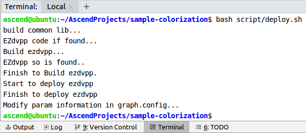

中文|[English](Readme_EN.md)

**该案例仅仅用于学习，打通流程，不对效果负责，不支持商用。**

# 黑白图像上色<a name="ZH-CN_TOPIC_0232337711"></a>

本应用支持运行在Atlas 200 DK上，实现了对黑白图像自动上色的功能。

当前分支中的应用适配**1.32.0.0及以上**版本的[DDK&RunTime](https://ascend.huawei.com/resources)。

## 前提条件<a name="zh-cn_topic_0228461725_section137245294533"></a>

部署此Sample前，需要准备好以下环境：

-   已完成Mind Studio的安装。
-   已完成Atlas 200 DK开发者板与Mind Studio的连接，交叉编译器的安装，SD卡的制作及基本信息的配置等。

## 部署<a name="zh-cn_topic_0228461725_section412811285117"></a>

可以选择如下快速部署或者常规方法部署，二选一即可：

1.  快速部署，请参考：  [https://gitee.com/ascend/samples/tree/1.32.0.0/common/faster-deploy](https://gitee.com/ascend/samples/tree/1.32.0.0/common/faster-deploy)  。

    > **说明：**   
    >-   该快速部署脚本可以快速部署多个案例，请选择**colorization**案例部署即可。  
    >-   该快速部署脚本自动完成了代码下载、模型转换、环境变量配置等流程，如果需要了解详细的部署过程请选择常规部署方式。转：**[2. 常规部署](#zh-cn_topic_0228461725_li3208251440)**  

2.  <a name="zh-cn_topic_0228461725_li3208251440"></a>常规部署，请参考：  [https://gitee.com/ascend/samples/tree/1.32.0.0/common/sample-README/sample-colorization](https://gitee.com/ascend/samples/tree/1.32.0.0/common/sample-README/sample-colorization)  。

    > **说明：**   
    >-   该部署方式，需要手动完成代码下载、模型转换、环境变量配置等过程。完成后，会对其中的过程更加了解。  


## 编译<a name="zh-cn_topic_0228461725_section3723145213347"></a>

1.  打开对应的工程。

    以Mind Studio安装用户在命令行中进入安装包解压后的“MindStudio-ubuntu/bin”目录，如：$HOME/MindStudio-ubuntu/bin。执行如下命令启动Mind Studio。

    **./MindStudio.sh**

    启动成功后，打开**sample\_colorization**工程，如[图 打开sample\_colorization工程](#zh-cn_topic_0228461725_zh-cn_topic_0219108795_fig05481157171918)所示。

    **图 1**  打开sample\_colorization工程<a name="zh-cn_topic_0228461725_zh-cn_topic_0219108795_fig05481157171918"></a>  
    

    

2.  在**src/param\_configure.conf**文件中配置相关工程信息。

    **图 2**  配置文件路径<a name="zh-cn_topic_0228461725_zh-cn_topic_0219108795_fig0391184062214"></a>  
    

    该配置文件默认配置内容如下：

    ```
    remote_host=192.168.1.2
    ```

    remote\_host：Atlas 200 DK开发者板的IP地址。

    > **说明：**   
    >-   注意参数填写时不需要使用“”符号。  
    >-   当前已经按照配置示例配置默认值，请按照配置情况自行修改。  

3.  执行deploy脚本， 进行配置参数调整及第三方库下载编译 打开Mind Studio工具的Terminal，此时默认在代码主目录下，执行如下命令在后台指执行deploy脚本，进行环境部署。如[图 执行deploy脚本](#zh-cn_topic_0228461725_zh-cn_topic_0219108795_fig63536151461)所示。

    **图 3**  执行deploy脚本<a name="zh-cn_topic_0228461725_zh-cn_topic_0219108795_fig63536151461"></a>  
    

    > **说明：**   
    >-   首次deploy时，没有部署第三方库时会自动下载并编译，耗时可能比较久，请耐心等待。后续再重新编译时，不会重复下载编译，部署如上图所示。  
    >-   deploy时，需要选择与开发板通信的主机侧ip，一般为虚拟网卡配置的ip。如果此ip和开发板ip属于同网段，则会自动选择并部署。如果非同网段，则需要手动输入与开发板通信的主机侧ip才能完成deploy。  

4.  开始编译，打开Mindstudio工具，在工具栏中点击**Build \> Build \> Build-Configuration**。会在目录下生成build和run文件夹。

    > **须知：**   
    >首次编译工程时，**Build \> Build**为灰色不可点击状态。需要点击**Build \> Edit Build Configuration**，配置编译参数后再进行编译。  

5.  将需要上色的图片上传至Host侧任一属组为HwHiAiUser用户的目录。

## 运行<a name="zh-cn_topic_0228461725_section1620073406"></a>

1.  在Mindstudio工具的工具栏中找到Run按钮，点击  **Run \> Run 'sample-colorization’**，如[图 程序已执行示意图](#zh-cn_topic_0228461725_zh-cn_topic_0219108795_fig18918132273612)所示，可执行程序已经在开发板执行。

    **图 4**  程序已执行示意图<a name="zh-cn_topic_0228461725_zh-cn_topic_0219108795_fig18918132273612"></a>  
    

    以上报错信息请忽略，因为Mind Studio无法为可执行程序传参，上述步骤是将可执行程序与依赖的库文件部署到开发者板，此步骤需要ssh登录到开发者板至相应的目录文件下手动执行，具体请参考以下步骤。

2.  在Mind Studio所在Ubuntu服务器中，以HwHiAiUser用户SSH登录到Host侧。

    **ssh HwHiAiUser@**_host\_ip_

    对于Atlas 200 DK，host\_ip默认为192.168.1.2（USB连接）或者192.168.0.2（NIC连接）。

3.  进入黑白图像上色应用的可执行文件所在路径。

    命令举例如下：

    **cd \~/HIAI\_PROJECTS/workspace\_mind\_studio/sample-colorization\_xxxxx/out**

    > **说明：**   
    >-   此路径中sample-colorization\_xxxxx的xxxxx是一串字母和数字的随机组合，每次重新编译运行时都会随机生成。  

4.  执行应用程序。

    执行**run\_colorization.py**脚本会将推理生成的图片保存至指定路径。

    命令示例如下所示：

    **python3 run\_colorization.py -i \~/example.jpg -o ./out/**

    -   -i：输入图片的路径，可以是目录，表示当前目录下所有图片都作为输入；也可以指定具体图片。
    -   -o：上色后的图片保存路径


